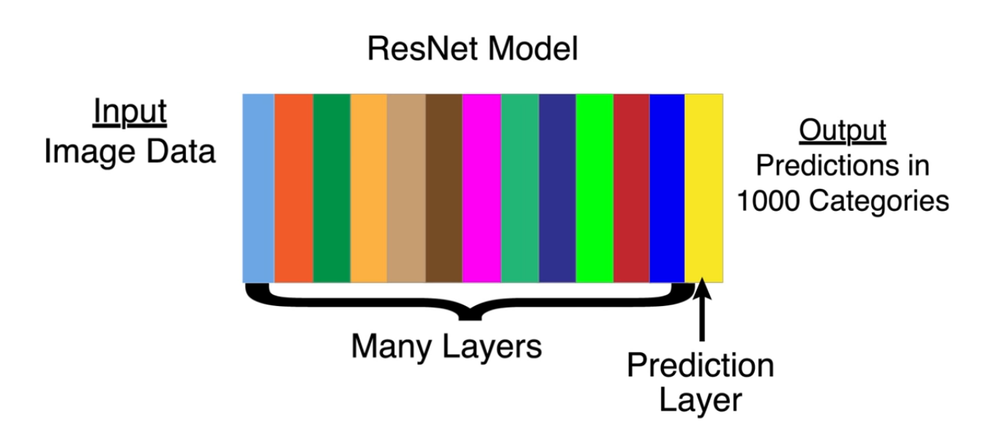
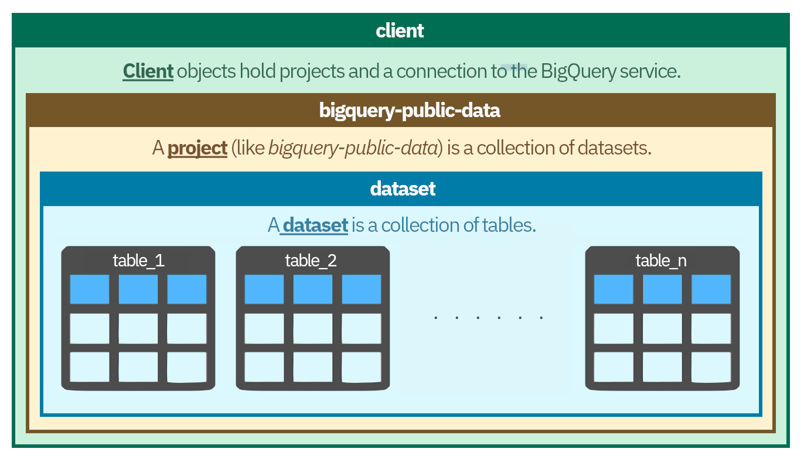
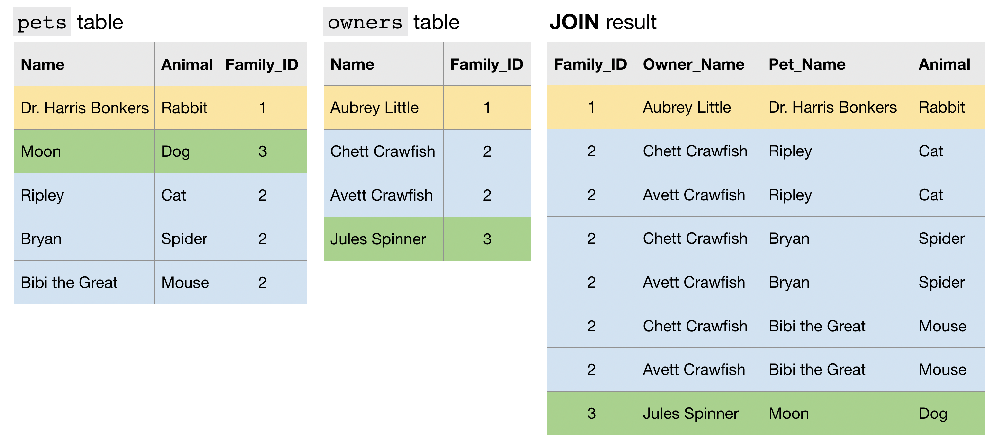
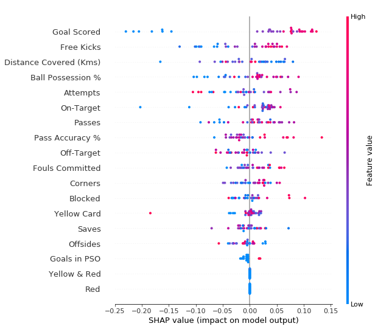
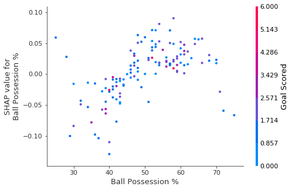

Data Scientist's Roadmap
==========
*A minimalist roadmap to The Data Science World, based on [Kaggle's Roadmap](https://www.kaggle.com/learn/overview).*

# Python
*Learn the most important language for data science.*

## Hello, Python
*A quick introduction to Python syntax, variable assignment, and numbers. [#](https://www.kaggle.com/colinmorris/hello-python)*

### Variable Assignment

```python
=
```

### Function Calls

```python
func(var)
var.func()
```

### Numbers and Arithmetic in Python

```python
/     # true division
//    # floor division
%     # modulus
**    # exponentiation
```

### Built-in Functions for Working with Numbers

```python
min()
max()
abs()
# conversion functions
int()
float()
```

## Functions and Getting Help
*Calling functions and defining our own, and using Python's builtin documentation. [#](https://www.kaggle.com/colinmorris/functions-and-getting-help)*

### Getting Help
*on modules, objects, instances, and ...*

```python
help()
dir()
```

### Functions

```python
def func_name(vars):
    # some useful codes
    return # some useful results
```

#### Docstrings

```python
""" some useful info about the function """  # `help()` returns this
```

#### Functions w/o Return

```python
print()
```

#### Default Arguments

```python
print(..., sep='\t')
```

#### Functions Applied to Functions

```python
fn(fn(arg))
string.lower().split()
```

## Booleans and Conditionals
*Using booleans for branching logic. [#](https://www.kaggle.com/colinmorris/booleans-and-conditionals)*

### Booleans

```python
True
False
bool()
```

#### Comparison Operations

```python
a == b    # a equal to b
a != b    # a not equal to b
a <  b    # a less than b
a >  b    # a greater than b
a <= b    # a less than or equal to b
a >= b    # a greater than or equal to b
```

#### Order of Operators
*PEMDAS combined with Boolean Values*

```python
()
**
+x, -x, ~x
*, /, //, %
+, -
<<, >>
&
^
|
==, !=, >, >=, <, <=, is, is not, in, not in
not
and
or
```

### Conditionals

```python
if
elif
else
```

#### Trues and Falses

- All numbers are treated as `True`, except `0`.
- All strings are treated as `True`, except the empty string `""`.
- Empty sequences (strings, lists, tuples, sets)  are `False` and the rest are `True`.

#### Conditional Expressions
*Setting a variable to either of two values depending on a condition.*

```python
outcome = 'failed' if grade < 50 else 'passed'
```

## Lists
*Lists and the things you can do with them. Includes indexing, slicing and mutating. [#](https://www.kaggle.com/colinmorris/lists)*

### Lists
*A mutable mix of same or different types of variables*

```python
[]
list()
```

#### Indexing

```python
planets = ["Mercury", "Venus", "Earth", "Mars", "Jupiter"]

# first element
planets[0]
# last element
planets[-1]
```

#### Slicing

```python
planets[:3]
planets[-3:]
```

#### Changing Lists

```python
planets[:3] = ['Mur', 'Vee', 'Ur']
```

#### List Functions

```python
len()
sorted()
max()
sum()
any()
```

#### Python Attributes & Methods
*Everything is an Object.*

```python
# complex number object
c = 12 + 5j
c.imag
c.real
```

```python
# integer number object
x = 12
x.bit_length()
```

#### List Methods

```python
list.append()
list.pop()
list.index()
in
```

### Tuples
*Immutable.*

```python
()
,
tuple()
```

```python
x = 0.125
numerator, denominator = x.as_integer_ratio()
```

## Loops and List Comprehensions
*For and while loops, and a much-loved Python feature: list comprehensions. [#](https://www.kaggle.com/colinmorris/loops-and-list-comprehensions)*

### Loops
*Use in every iteratable objects: list, tuples, strings, ...*

```python
for - in - :
    # some useful codes
```

- `range()`
- `while`

### List Comprehensions

```python
[- for - in -]
```

```python
squares = [n**2 for n in range(10)]
# constant
[32 for planet in planets]
```

```python
# with if
short_planets = [planet.upper() + "!" for planet in planets if len(planet) < 6]
```

```python
# combined with other functions
return len([num for num in nums if num < 0])
return sum([num < 0 for num in nums])
return any([num % 7 == 0 for num in nums])
```

Solving a problem with less code is always nice, but it's worth keeping in mind the following lines from **The Zen of Python**.
> Readability counts.<br>
> Explicit is better than implicit.

### Enumerate

```python
for index, item in enumerate(items):
    # some useful codes
```

## String and Directories
*Working with strings and dictionaries, two fundamental Python data types. [#](https://www.kaggle.com/colinmorris/strings-and-dictionaries)*

### Strings
*Immutable.*

```python
''
""
""" """
str()
```

```python
[char + '! ' for char in "Planet"]
>>> ['P! ', 'l! ', 'a! ', 'n! ', 'e! ', 't! ']
```

```python
"Planet"[0] = 'M'
>>> TypeError: 'str' object does not support item assignment
```

#### String Methods

```python
str.upper()
str.lower()
str.index()
str.startswith()
str.endswith()
```

#### String and List, Back and Forward

```python
# split
year, month, day = '2020-03-05'.split('-')
year, month, day
>>> ('2020', '03', '05')
```

```python
# join
'/'.join([month, day, year])
>>> '03/05/2020'
```

#### String Formatting

```python
"{}".format()
f"{}"
```

### Dictionaries
*Pairs of keys,values.*

```python
{}
dict()
```

```python
numbers = {'one':1, 'two':2, 'three':3}
numbers['one']
numbers['eleven'] = 11
```

#### Dictionary Comprehensions

```python
planet_to_initial = {planet: planet[0] for planet in planets}
```

#### Access to all Keys or all Values

```python
dict.keys()
dict.values()
```

```python
' '.join(sorted(planet_to_initial.values()))
```

#### Get key by value

```python
key_of_min_value = min(numbers, key=numbers.get)
```

#### `in`

```python
'M' in planet_to_initial.values()
>>> True
```

#### Loops in Dictionaries

```python
# loop over keys
for planet in planet_to_initial:
    print(planet)
```

```python
# loop over (key, value) pairs using `item`
for planet, initial in planet_to_initial.items():
    print(f"{planet} begins with \"{initial}\"")
```

## Working with External Libraries
*Imports, operator overloading, and survival tips for venturing into the world of external libraries. [#](https://www.kaggle.com/colinmorris/working-with-external-libraries)*

### Imports

```python
# simple import, `.` access
import math
math.pi
```

```python
# `as` import, short `.` access
import math as mt
mt.pi
```

```python
# `*` import, simple access
from math import *
pi
```

The problem of `*` import is that some modules (ex. `math` and `numpy`) have functions with same name (ex. `log`) but with different semantics. So one of them overwrites (or "shadows") the other. It is called **overloading**.

```python
# combined, solution for the `*` import
from math import log, pi
from numpy import asarray
```

### Submodules

Modules contain variables which can refer to functions or values. Sometimes they can also have variables referring to other modules.

```python
import numpy
dir(numpy.random)
>>> ['set_state', 'shuffle', 'standard_cauchy', 'standard_exponential', 'standard_gamma', 'standard_normal', 'standard_t', 'test', 'triangular', 'uniform', ...]
```

```python
# make an array of random numbers
rolls = numpy.random.randint(low=1, high=6, size=10)
rolls
>>> array([3, 2, 5, 2, 4, 2, 2, 3, 2, 3])
```

#### Get Help

Standard Python datatypes are: `int`, `float`, `bool`, `list`, `str`, and `dict`.

As you work with various libraries for specialized tasks, you'll find that they define their own types. For example

- Matplotlib: `Subplot`, `Figure`, `TickMark`, and `Annotation`
- Pandas: `DataFrame` and `Series`
- Tensorflow: `Tensor`

Use `type()` to find the type of an object. Use `dir()` and `help()` for more details.

```python
dir(umpy.ndarray)
>>> [...,'__bool__', ..., '__delattr__', '__delitem__', '__dir__', ..., '__sizeof__', ..., 'max', 'mean', 'min', ..., 'sort', ..., 'sum', ..., 'tobytes', 'tofile', 'tolist', 'tostring', ...]
```

### Operator Overloading

#### Index

```python
# list
xlist = [[1,2,3], [2,4,6]]
xlist[1,-1]
>>> TypeError: list indices must be integers or slices, not tuple
```

```python
# numpy array
xarray = numpy.asarray(xlist)
xarray[1,-1]
>>> 6
```

#### Add

```python
# list
[3, 4, 1, 2, 2, 1] + 10
>>> TypeError: can only concatenate list (not "int") to list
```

```python
# numpy array
rolls + 10
>>> array([13, 12, 15, 12, 14, 12, 12, 13, 12, 13])
```

```python
# tensorflow
import tensorflow as tf
a = tf.constant(1)
b = tf.constant(1)
a + b
>>> <tf.Tensor 'add:0' shape=() dtype=int32>
```

When Python programmers want to define how operators behave on their types, they do so by implementing **Dunder (Special) Methods**, methods with special names beginning and ending with 2 underscores such as `__add__` or `__contains__`. More info: https://is.gd/3zuhhL

# Pandas
*Solve short hands-on challenges to perfect your data manipulation skills.*

## Creating, Reading and Writing
*You can't work with data if you can't read it. [#](https://www.kaggle.com/residentmario/creating-reading-and-writing)*

### Creating Data

#### DataFrame

It is a **table** and contains an array of individual entries. Each entry corresponds to a row (or record) and a column.

```python
import pandas as pd
pd.DataFrame({"Apples": [50, 21], "Bananas": [131, 2]})
```

The syntax for declaring a new one is a **dictionary** whose keys are the column names, and whose values are a list of entries.

The list of row labels used in a DataFrame is known as an Index. We can assign values to it by using an `index` parameter in our constructor.

```python
pd.DataFrame({"Apples": [50, 21], "Bananas": [131, 2]}, index=["2018 Sales", "2019 Sales"])
```

#### Series

In essence, it is a single **column** of a DataFrame, a sequence of data values.

```python
pd.Series([30, 50, 21])
```

You can assign column values to the Series the same way as before, using an `index` parameter. However, a Series does not have a column name, it only has one overall `name`.

```python
pd.Series([30, 50, 21], index=["2017 Sales", "2018 Sales", "2019 Sales"], name="Apples")
```

### Reading Data Files

Data can be stored in any of a number of different forms and formats. By far the most basic of these is the humble CSV file. A CSV file is a table of values separated by commas.

```python
# load data
wine_reviews = pd.read_csv("../input/wine-reviews/winemag-data-130k-v2.csv", index_col=0)
```

- If your CSV file has a built-in index, pandas can use that column for the index (instead of creating a new one automatically).

```python
# data dimention
wine_reviews.shape

# columns' name
wine_reviews.columns

# top rows
wine_reviews.head()

# bottom rows
wine_reviews.tail()
```

### Writing Data to File

```python
animals = pd.DataFrame({"Cows": [12, 20], "Goats": [22, 19]}, index=["Year 1", "Year 2"])
animals.to_csv("cows_and_goats.csv")
```

## Indexing, Selecting & Assigning
*Pro data scientists do this dozens of times a day. You can, too! [#](https://www.kaggle.com/residentmario/indexing-selecting-assigning)*

### Naive Accessors

In Python, we can access the property of an object by accessing it as an attribute. A `reviews` object, might have a `country` property, which we can access by calling `reviews.country`. Columns in a pandas DataFrame work in much the same way.

If we have a Python dictionary, we can access its values using the indexing `[]` operator.

```python
# select the `country` column
reviews["country"]
```

A pandas Series looks kind of like a dictionary. So, to drill down to a single specific value, we need only use the indexing operator `[]` once more.

```python
# select the first value from the `country` column
reviews["country"][0]
>>> 'Italy'
```

### Indexing in Pandas

For more advanced operations, pandas has its own accessor operators, `iloc` and `loc`.

#### Index-based Selection
*Selecting data based on its **numerical position** in the data, like a matrix.*

```python
# select the first row
reviews.iloc[0]

# select the first column, `:` means everything
reviews.iloc[:, 0]

# select the first value from the `country` column
reviews["country"].iloc[0]

# select the last five elements of the dataset
reviews.iloc[-5:]
```

#### Label-based Selection
*Selecting data based on its **index value**, with **inclusive** range.*

```python
# select the first value from the `country` column
reviews.loc[0, "country"]

# select all the entries from three specific columns
reviews.loc[:, ["taster_name", "taster_twitter_handle", "points"]]
```

#### Inclusive Range, `iloc` vs. `loc`

```python
# select first three rows
reviews.iloc[:3]
# or
reviews.loc[:2]
```

```python
# select the first 100 records of the `country` and `variety` columns.
cols_idx = [0, 11]
reviews.iloc[:100, cols_idx]
# or
cols = ["country", "variety"]
reviews.loc[:99, cols]
```

#### Manipulating the Index

```python
reviews.set_index("title")
```

### Conditional Selection

To do interesting things with the data, we often need to ask questions based on conditions.

To combine multiple conditions in pandas, **bitwise operators** must be used.

```python
&    # AND          x & y
|    # OR           x | y
^    # XOR          x ^ y
~    # NOT          ~x
>>   # right shift  x>>
<<   # left shift   x<<
```

For example, suppose that we're interested in better-than-average wines produced in Italy.

```python
cond1 = (reviews["country"] == "Italy")
cond2 = (reviews["points"] >= 90)
reviews.loc[cond1 & cond2]
```

#### Built-in Conditional Selectors

`isin()` lets you select data whose value "is in" a list of values.

```python
# select wines only from Italy or France
reviews.loc[reviews["country"].isin(["Italy", "France"])]
```

`isna()` and `notna()` let you highlight values which are (or are not) empty (NaN).

```python
# filter out wines lacking a price tag in the dataset
reviews.loc[reviews["price"].notna()]
```

- `isnull()` is an alias for `isna()`, same as `notnull()` for `notna()`.

#### SQL-like Queries

```python
# query a df like SQL datasets
wine_reviews.query("price > 100 and country = 'Italy'")
```

### Assigning Data

```python
# you can assign either a constant value
reviews["critic"] = "everyone"

# or with an iterable of values
reviews["index_backwards"] = range(len(reviews), 0, -1)
```

## Summary Functions and Maps
*Extract insights from your data. [#](https://www.kaggle.com/residentmario/summary-functions-and-maps)*

### Summary Functions

```python
# get summary statistic about a DataFrame
reviews.describe()
```

- `count`: shows how many rows have non-missing values.
- `mean`: the average.
- `std`: the standard deviation, measures how numerically spread out the values are.
- `min`, `25%` (25th percentile), `50%` (50th percentiles), `75%` (75th percentiles) and `max`

```python
# get summary statistic about a Series
reviews["points"].describe()

# see the mean
reviews["points"].mean()

# see a list of unique values
reviews["points"].unique()

# see a list of unique values and how often they occur
reviews["points"].value_counts()

# get the titles & points of the 3 highest point
reviews["points"].nlargest(3)
```

```python
# get the title of the wine with the highest points-to-price ratio
max_p2pr = (reviews["points"] / reviews["price"]).idxmax()
reviews.loc[max_p2pr, "title"]
>>> 'Bandit NV Merlot (California)'
```

### Maps

A function that takes one set of values and "maps" them to another set of values, for creating new representations from existing data.

#### `map()`

```python
# remean the scores the wines received to 0
review_points_mean = reviews["points"].mean()
reviews["points"].map(lambda p: p - review_points_mean)
```

```python
# create a series counting how many times each of "tropical" or "fruity" appears in the description column
n_tropical = reviews["description"].map(lambda desc: "tropical" in desc).sum()
n_fruity = reviews["description"].map(lambda desc: "fruity" in desc).sum()
pd.Series([n_tropical, n_fruity], index=["tropical", "fruity"])
```

The function you pass to `map()` should expect a single value from the Series (a point value, in the above example), and return a transformed version of that value. `map()` returns a new **Series**.

#### `apply()`

```python
# remean the scores the wines received to 0
def remean_points(row):
    row["points"] = row["points"] - review_points_mean
    return row
reviews.apply(remean_points, axis="columns")
```

```python
# create a series with the number of stars corresponding to each review
def stars(row):
    # any wines from country X should automatically get 3 stars, because of ADs' MONEY!
    if row["country"] == "X":
        return 3
    elif row["points"] >= 95:
        return 3
    elif row["points"] >= 85:
        return 2
    else:
        return 1
reviews.apply(stars, axis="columns")
```

`apply()` is the equivalent method if we want to transform a whole DataFrame by calling a custom method on each row. `apply()` returns a new **DataFrame**.

If we had called `reviews.apply()` with `axis="index"`, then instead of passing a function to transform each row, we would need to give a function to transform each column.

#### Pandas built-ins Common Mapping Operators

They perform a simple operation between a lot of values on the left and a single (a lot of) value(s) on the right.

```python
# remean the scores the wines received to 0
review_points_mean = reviews["points"].mean()
reviews["points"] - review_points_mean
```

```python
# combine country and region information in the dataset
reviews["country"] + " - " + reviews["region_1"]
```

These operators are **faster** than `map()` or `apply()` because they uses speed ups built into pandas. All of the standard Python operators (`>`, `<`, `==`, and so on) work in this manner.

However, they are **not as flexible as** `map()` or `apply()`, which can do more advanced things, like applying conditional logic, which cannot be done with addition and subtraction alone.

## Grouping and Sorting
*Scale up your level of insight. The more complex the dataset, the more this matters. [#](https://www.kaggle.com/residentmario/grouping-and-sorting)*

### Groupwise Analysis

Maps allow us to transform data in a DataFrame or Series one value at a time for an entire column. However, often we want to group our data, and then do something specific to the group the data is in.

#### `groupby()`

```python
# replicate what `value_counts()` does
reviews.groupby("points")["points"].count()

# get the minimum price from each group of points
reviews.groupby("points")["price"].min()

# get a series whose index is the taster_twitter_handle values count how many reviews each person wrote
reviews.groupby("taster_twitter_handle").size()
# or
reviews.groupby("taster_twitter_handle")["taster_twitter_handle"].count()

# get the title of the first wine reviewed from each winery
reviews.groupby("winery").apply(lambda df: df["title"].iloc[0])
```

#### Aggregate Different Functions Simultaneously

```python
# get a dataframe whose index is the variety category and values are the `min` and `max` prices
reviews.groupby("variety")["price"].agg([min, max])
```

#### Multi-indexes, Group by More than One Column

```python
# pick out the best wine by country and province
reviews.groupby(["country", "province"]).apply(lambda df: df.loc[df["points"].idxmax()])
```

Multi-indices have several methods for dealing with their tiered structure which are absent for single-level indices.

They also require two levels of labels to retrieve a value.

The use cases for a multi-index are detailed alongside instructions on using them in the [MultiIndex / Advanced Selection](https://pandas.pydata.org/pandas-docs/stable/advanced.html) section of the pandas documentation.

```python
# convert back to a regular index
count_prov_best.reset_index()
```

### Sorting

#### `sort_values()`

```python
# sort (country, province) based on how many reviews are belong to
count_prov_reviewed = reviews.groupby(["country", "province"])["description"].agg([len])
count_prov_reviewed.reset_index().sort_values(by="len", ascending=False)
```

#### Sort by More than One Column

```python
count_prov_reviewed.reset_index().sort_values(by=["country", "len"], ascending=False)
```

#### `sort_index()`

```python
# get a series whose index is wine prices and values is the maximum points a wine costing that much was given in a review. sort the values by price, ascending
reviews.groupby("price")["points"].max().sort_index(ascending=True)
```

## Data Types and Missing Values
*Deal with the most common progress-blocking problems. [#](https://www.kaggle.com/residentmario/data-types-and-missing-values)*

### Dtypes

The data type for a column in a DataFrame or a Series is known as the `dtype`.
  - `int64`, `float64`, `object`

```python
# a dataframe
reviews.dtypes

# a series
reviews["price"].dtype

# a dataframe or series index
reviews.index.dtype

# convert a dtype
reviews["points"].astype("float64")
```

### Missing Values (NaNs)

#### `isna()`, `notna()`

```python
# get a series of True & False, based on where NaNs are
reviews["price"].isna()

# find the number of NaNs
reviews["price"].isna().sum()

# create a dataframe of rows with missing country
reviews[reviews["country"].isna()]
```

- `isnull()` is an alias for `isna()`, same as `notnull()` for `notna()`.

#### `fillna()`

```python
# fill NaNs with Unknown
reviews["region_1"].fillna("Unknown")
```

#### `replace()`

```python
# replace missing data which is given some kind of sentinel values
reviews["region_1"].replace(["Unknown", "Undisclosed", "Invalid"], "NaN")
```

#### `dropna()`

```python
# filter rows with NaNs
reviews.dropna(axis=0)

# filter columns with NaNs
reviews.dropna(axis=1)
```

## Renaming and Combining
*Data comes in from many sources. Help it all make sense together. [#](https://www.kaggle.com/residentmario/renaming-and-combining)*

### Renaming

#### `rename()`

```python
# change the names of columns
reviews.rename(columns={"region_1": "region", "region_2": "locale"})

# change the indices of rows
reviews.rename(index={0: "firstEntry", 1: "secondEntry"})
```

### `raname_axis()`

```python
# change the names of axes, form rows to wines, from columns to fields
reviews.rename_axis("wines", axis="rows").rename_axis("fields", axis="columns")
```

### Combining

We will sometimes need to combine different DataFrames and/or Series. Pandas has three core methods for doing this. In order of increasing complexity, these are

#### `concat()`

It will smush a list of elements together along an axis.

This is useful when we have data in different DataFrame or Series objects but having the same columns.

```python
canadian_yt = pd.read_csv("../input/youtube-new/CAvideos.csv")
british_yt = pd.read_csv("../input/youtube-new/GBvideos.csv")
pd.concat([canadian_yt, british_yt])
```

#### `join()`

It lets you combine different DataFrame objects which have an index in common.

```python
# pull down videos that happened to be trending on the same day in both Canada and the UK
left = canadian_yt.set_index(["title", "trending_date"])
right = british_yt.set_index(["title", "trending_date"])
left.join(right, lsuffix="_CAN", rsuffix="_UK")
```

- The `lsuffix` and `rsuffix` parameters are necessary when the data has the same column names in both datasets.

#### `merge()`

# Data Visualization
*Make great data visualizations. A great way to see the power of coding!*

## Line Charts
*Visualize trends over time. [#](https://www.kaggle.com/alexisbcook/line-charts)*

### Set up the notebook

```python
import pandas as pd
pd.plotting.register_matplotlib_converters()
import matplotlib.pyplot as plt
%matplotlib inline
import seaborn as sns
```

### Line Chart

```python
# load a timeseries data file
spotify_data = pd.read_csv("../input/spotify.csv", index_col="Date", parse_dates=True)

# set the width and height of the figure
plt.figure(figsize=(14,6))

# add title
plt.title("Daily Global Streams of Popular Songs in 2017-2018")

# plot a line chart for daily global streams of each song
sns.lineplot(data=spotify_data)

# plot a subset of the data
sns.lineplot(data=spotify_data["Shape of You"], label="Shape of You")

# add label for horizontal axis
plt.xlabel("Date")
```

## Bar Charts and Heatmaps
*Use color or length to compare categories in a dataset. [#](https://www.kaggle.com/alexisbcook/bar-charts-and-heatmaps)*

### Bar Chart

```python
# load data
flight_data = pd.read_csv("../input/flight_delays.csv", index_col="Month")

# add title
plt.title("Average Arrival Delay for Spirit Airlines Flights, by Month")

# rotate labels for horizontal axis
plt.xticks(rotation="vertical")

# plot a bar chart, showing average arrival delay for Spirit Airlines flights by month
sns.barplot(x=flight_data.index, y=flight_data["NK"])

# add label for vertical axis
plt.ylabel("Arrival delay (in minutes)")
```

- **Note**: You must select the indexing column with `flight_data.index`, and it is not possible to use `flight_data['Month']`, because when we loaded the dataset, the `"Month"` column was used to index the rows.

### Heatmap

```python
# add title
plt.title("Average Arrival Delay for Each Airline, by Month")

# plot a heatmap, showing average arrival delay for each airline by month
sns.heatmap(data=flight_data, annot=True)

# add label for horizontal axis
plt.xlabel("Airline")
```

```python
# get the maximum average delay on March
flight_data.loc[3].max()

# find the aireline with the minimum average delay on October
flight_data.loc[10].idxmin()
```

## Scatter Plots
*Leverage the coordinate plane to explore relationships between variables. [#](https://www.kaggle.com/alexisbcook/scatter-plots)*

### Scatter Plots

```python
# load data
insurance_data = pd.read_csv("../input/insurance.csv")

# a simple scatter plot
sns.scatterplot(x=insurance_data["bmi"], y=insurance_data["charges"])

# add a regression line
sns.regplot(x=insurance_data["bmi"], y=insurance_data["charges"])

# a color-coded scatter plot
sns.scatterplot(x=insurance_data["bmi"], y=insurance_data["charges"], hue=insurance_data["smoker"])

# add two regression lines, corresponding to hue
sns.lmplot(x="bmi", y="charges", hue="smoker", data=insurance_data)

# a categorical scatter plot with non-overlapping points (swarmplot)
sns.swarmplot(x=insurance_data["smoker"], y=insurance_data["charges"])
```

## Distributions
*Create histograms and density plots. [#](https://www.kaggle.com/alexisbcook/distributions)*

### Histogram

```python
# load data
iris_data = pd.read_csv("../input/iris.csv", index_col="Id")

# a simple histogram
sns.distplot(a=iris_data["Petal Length (cm)"], kde=False)

# a kde (kernel density estimate) plot
sns.kdeplot(data=iris_data["Petal Length (cm)"], shade=True)

# a 2D kde plot
sns.jointplot(x=iris_data["Petal Length (cm)"], y=iris_data["Sepal Width (cm)"], kind="kde")
```

### Color-coded Plots

```python
# load data
iris_set_data = pd.read_csv("../input/iris_setosa.csv", index_col="Id")
iris_ver_data = pd.read_csv("../input/iris_versicolor.csv", index_col="Id")
iris_vir_data = pd.read_csv("../input/iris_virginica.csv", index_col="Id")

# kde plots for each one, histograms can be used too
sns.kdeplot(data=iris_set_data["Petal Length (cm)"], label="Setosa", shade=True)
sns.kdeplot(data=iris_ver_data["Petal Length (cm)"], label="Versicolor", shade=True)
sns.kdeplot(data=iris_vir_data["Petal Length (cm)"], label="Virginica", shade=True)

# force legend to appear
plt.legend()
```

## Choosing Plot Types
*Decide how to best tell the story behind your data. [#](https://www.kaggle.com/alexisbcook/choosing-plot-types-and-custom-styles)*

### Trends

- A trend is defined as a pattern of **change**.
- `sns.lineplot` - Line charts are best to show trends over a period of time, and multiple lines can be used to show trends in more than one group.

### Relationship

- `sns.barplot` - Bar charts are useful for comparing quantities corresponding to different groups.
- `sns.heatmap` - Heatmaps can be used to find color-coded patterns in tables of numbers.
- `sns.scatterplot` - Scatter plots show the relationship between two continuous variables; if color-coded, we can also show the relationship with a third categorical variable.
- `sns.regplot` - Including a regression line in the scatter plot makes it easier to see any linear relationship between two variables.
- `sns.lmplot` - This command is useful for drawing multiple regression lines, if the scatter plot contains multiple, color-coded groups.
- `sns.swarmplot` - Categorical scatter plots show the relationship between a continuous variable and a categorical variable.

### Distribution

- A distribution shows the possible values that we can **expect** to see in a variable, along with how likely they are.
- `sns.distplot` - Histograms show the distribution of a single numerical variable.
- `sns.kdeplot` - KDE plots (or 2D KDE plots) show an estimated, smooth distribution of a single numerical variable (or two numerical variables).
- `sns.jointplot` - This command is useful for simultaneously displaying a 2D KDE plot with the corresponding KDE plots for each individual variable.

## Final Project
*Practice for real-world application. [#](https://www.kaggle.com/alexisbcook/final-project)*

### Use your own dataset

```python
# list all your datasets' folders
import os
print(os.listdir("../input"))
```

## Creating Your Own Notebooks
*How to put your new skills to use for your next personal or work project. [#](https://www.kaggle.com/alexisbcook/creating-your-own-notebooks)*

# Geospatial Analysis
*Create interactive maps, and discover patterns in geospatial data.*

## Your First Map
*Get started with plotting in GeoPandas. [#](https://www.kaggle.com/alexisbcook/your-first-map)*

### Introduction

With this course you can find solutions for several real-world problems like:

- Where should a global non-profit expand its reach in remote areas of the Philippines?
- How do purple martins, a threatened bird species, travel between North and South America? Are the birds travelling to conservation areas?
- Which areas of Japan could potentially benefit from extra earthquake reinforcement?
- Which Starbucks stores in California are strong candidates for the next Starbucks Reserve Roastery location?
- ...

### Reading Data

```python
import geopandas as gpd
```

The data was loaded into a (GeoPandas) `GeoDataFrame` object has all of the capabilities of a (Pandas) DataFrame. So, every command that you can use with a DataFrame will work with the data!

There are many, many different geospatial file formats, such as [shapefile](https://en.wikipedia.org/wiki/Shapefile), [GeoJSON](https://en.wikipedia.org/wiki/GeoJSON), [KML](https://en.wikipedia.org/wiki/Keyhole_Markup_Language), and [GPKG](https://en.wikipedia.org/wiki/GeoPackage).

- shapefile is the most common file type that you'll encounter, and
- all of these file types can be quickly loaded with the `read_file()` function.

Every GeoDataFrame contains a special `geometry` column. It contains all of the geometric objects that are displayed when we call the `plot()` method. While this column can contain a variety of different datatypes, each entry will typically be a `Point`, `LineString`, or `Polygon`.

### Create Your Map
*Create it layer by layer.*

```python
# load data
world_loans = gpd.read_file(
    "../input/geospatial-learn-course-data/kiva_loans/kiva_loans/kiva_loans.shp"
)

# define a base map with county boundaries
world = gpd.read_file(gpd.datasets.get_path("naturalearth_lowres"))
ax = world.plot(figsize=(20, 20), color="whitesmoke", linestyle=":", edgecolor="lightgray")

# add loans to the base map
world_loans.plot(ax=ax, color="black", markersize=2)
```

You can subset the data for more details.

```python
# subset the data
phl_loans = world_loans.loc[world_loans["country"] == "Philippines"].copy()

# enable fiona driver & load a KML file containing island boundaries
gpd.io.file.fiona.drvsupport.supported_drivers["KML"] = "rw"
phl = gpd.read_file("../input/geospatial-learn-course-data/Philippines_AL258.kml", driver="KML")

# define a base map with county boundaries
ax_ph = phl.plot(figsize=(20, 20), color="whitesmoke", linestyle=":", edgecolor="lightgray")

# add loans to the base map
phl_loans.plot(ax=ax_ph, color="black", markersize=2)
```

## Coordinate Reference Systems
*It's pretty amazing that we can represent the Earth's surface in 2 dimensions! [#](https://www.kaggle.com/alexisbcook/coordinate-reference-systems)*

### Introduction

The world is a three-dimensional globe. So we have to use a map projection method to render it as a flat surface. Map projections can't be 100% accurate. Each projection distorts the surface of the Earth in some way, while retaining some useful property.

- The equal-area projections preserve **area**.
- The equidistant projections preserve **distance**.

We use a coordinate reference system (CRS) to show how the projected points correspond to real locations on Earth. CRSs are referenced by [European Petroleum Survey Group (EPSG)](http://www.epsg.org/) codes.

### Setting the CRS

When we create a GeoDataFrame from a shapefile, the CRS is already imported for us. But when creating a GeoDataFrame from a CSV file, we have to set the CRS to [EPSG 4326](https://epsg.io/4326), corresponds to coordinates in latitude and longitude.

```python
# create a DataFrame with health facilities in Ghana
import pandas as pd
facilities_df = pd.read_csv("../input/geospatial-learn-course-data/ghana/ghana/health_facilities.csv")

# convert the DataFrame to a GeoDataFrame
import geopandas as gpd
facilities = gpd.GeoDataFrame(facilities_df, geometry=gpd.points_from_xy(facilities_df.Longitude, facilities_df.Latitude))

# set the CRS code
facilities.crs = {"init": "epsg:4326"}
```

- We begin by creating a DataFrame containing columns with latitude and longitude coordinates.
- To convert it to a GeoDataFrame, we use `gpd.GeoDataFrame()`.
- The `gpd.points_from_xy()` function creates Point objects from the latitude and longitude columns.

### Re-projecting

Re-projecting refers to the process of changing the CRS. This is done in GeoPandas with the `to_crs()` method. For example, when plotting multiple GeoDataFrames, it's important that they all use the same CRS.

```python
# load a GeoDataFrame containing regions in Ghana
regions = gpd.read_file(
    "../input/geospatial-learn-course-data/ghana/ghana/Regions/Map_of_Regions_in_Ghana.shp"
)
regions.crs
>>> 32630
```

```python
# create a map
ax = regions.plot(figsize=(8, 8), color="whitesmoke", linestyle=":", edgecolor="black")
facilities.to_crs(epsg=32630).plot(ax=ax, alpha=0.6, markersize=1, zorder=1)
```

In case the EPSG code is not available in GeoPandas, we can change the CRS with what's known as the "proj4 string" of the CRS. The proj4 string to convert to latitude/longitude coordinates is:

```python
# change the CRS to EPSG 4326
regions.to_crs("+proj=longlat +ellps=WGS84 +datum=WGS84 +no_defs")
```

### Attributes of Geometric Objects

For an arbitrary GeoDataFrame, the type in the `geometry` column depends on what we are trying to show: for instance, we might use:

- a `Point` for the epicenter of an earthquake,
- a `LineString` for a street, or
- a `Polygon` to show country boundaries.

All three types of geometric objects have built-in attributes that you can use to quickly analyze the dataset.

```python
# get the x- or y-coordinates of a point from the x and y attributes
facilities["geometry"].x

# calculate the area (in square kilometers) of all polygons
sum(regions["geometry"].to_crs(epsg=3035).area) / 10**6
```

-  [ESPG 3035](https://epsg.io/3035) Scope: Statistical mapping at all scales and other purposes where **true area** representation is required.

### Techniques from the Exercise

```python
# load data
import pandas as pd
birds_df = pd.read_csv(
    "../input/geospatial-learn-course-data/purple_martin.csv", parse_dates=["timestamp"]
)

# create the GeoDataFrame
import geopandas as gpd
birds = gpd.GeoDataFrame(
    birds_df, geometry=gpd.points_from_xy(birds_df["location-long"], birds_df["location-lat"])
)

# create GeoDataFrame showing path for each bird
from shapely.geometry import LineString
path_df = (
    birds.groupby("tag-local-identifier")["geometry"]
    .apply(list)
    .apply(lambda x: LineString(x))
    .reset_index()
)
path_gdf = gpd.GeoDataFrame(path_df, geometry=path_df["geometry"])
path_gdf.crs = {"init": "epsg:4326"}
```

## Interactive Maps
*Learn how to make interactive heatmaps, choropleth maps, and more! [#](https://www.kaggle.com/alexisbcook/interactive-maps)*

### The Data

```python
# load data
import pandas as pd
crimes = pd.read_csv(
    "../input/geospatial-learn-course-data/crimes-in-boston/crimes-in-boston/crime.csv",
    encoding="latin-1",
)

# drop rows with missing locations
crimes.dropna(subset=["Lat", "Long", "DISTRICT"], inplace=True)

# focus on major crimes in 2018
crimes = crimes[
    crimes["OFFENSE_CODE_GROUP"].isin(
        [
            "Larceny",
            "Auto Theft",
            "Robbery",
            "Larceny From Motor Vehicle",
            "Residential Burglary",
            "Simple Assault",
            "Harassment",
            "Ballistics",
            "Aggravated Assault",
            "Other Burglary",
            "Arson",
            "Commercial Burglary",
            "HOME INVASION",
            "Homicide",
            "Criminal Harassment",
            "Manslaughter",
        ]
    )
]
crimes = crimes[crimes["YEAR"] == 2018]

# focus on daytime robberies
daytime_robberies = crimes[
    ((crimes["OFFENSE_CODE_GROUP"] == "Robbery") & (crimes["HOUR"].isin(range(9, 18))))
]
```

### Base Map

In this tutorial, you'll learn how to create interactive maps with the `folium` package. We create the base map with `folium.Map()`.

```python
# create the base map
from folium import Map
base_map = Map(location=[42.32, -71.0589], tiles="openstreetmap", zoom_start=10)
```

- `location` sets the initial center of the map. We use the latitude (42.32° N) and longitude (-71.0589° E) of the city of Boston.
- `tiles` changes the styling of the map; in this case, we choose the OpenStreetMap style. If you're curious, you can find the other options listed [here](https://github.com/python-visualization/folium/tree/master/folium/templates/tiles).
- `zoom_start` sets the initial level of zoom of the map, where higher values zoom in closer to the map.

### Markers

We add markers to the map with `folium.Marker()`. Each marker below corresponds to a different robbery.

```python
# define the base map
map_marker = map_base

# add points to the map
from folium import Marker
for idx, row in daytime_robberies.iterrows():
    Marker([row["Lat"], row["Long"]], popup=row["HOUR"]).add_to(map_marker)

# display the map
map_marker
```

### Markers' Cluster

If we have a lot of markers to add, `folium.plugins.MarkerCluster()` can help to declutter the map. Each marker is added to a `MarkerCluster` object.

```python
# define the base map
map_cluser = map_base

# add points to the map
from folium.plugins import MarkerCluster
mc = MarkerCluster()
from folium import Marker
import math
for idx, row in daytime_robberies.iterrows():
    if not math.isnan(row["Lat"]) and not math.isnan(row["Long"]):
        mc.add_child(Marker([row["Lat"], row["Long"]]))

map_cluser.add_child(mc)

# display the map
map_cluser
```

- We used `math.isnan()` because `row["Lat"]` or `row["Long"]` are `float`.

### Bubble Maps

A bubble map uses circles instead of markers. By varying the size and color of each circle, we can also show the relationship between location and two other variables.

We create a bubble map by using `folium.Circle()` to iteratively add circles.

```python
# define the base map
map_bubble = map_base

# define color/size producer function
def color_producer(val):
    if val <= 12:
        # robberies that occurred in hours 9-12
        return "forestgreen"
    else:
        # robberies from hours 13-17
        return "darkred"

# add a bubble map to the base map
from folium import Circle
for i in range(len(daytime_robberies)):
    Circle(
        location=[daytime_robberies.iloc[i]["Lat"], daytime_robberies.iloc[i]["Long"]],
        radius=20,
        color=color_producer(daytime_robberies.iloc[i]["HOUR"]),
    ).add_to(map_bubble)

# display the map
map_bubble
```

- `location` is a list containing the center of the circle, in latitude and longitude.
- `radius` sets the radius of the circle.
  - We can implement this by defining a function similar to the `color_producer()` function that is used to vary the color of each circle.
- `color` sets the color of each circle.
  - `The color_producer()` function is used to visualize the effect of the hour on robbery location.


### Heatmaps

To create a heatmap, we use `folium.plugins.HeatMap()`. This shows the density of crime in different areas of the city, where red areas have relatively more criminal incidents.

```python
# define the base map
map_heat = map_base

# add a heatmap to the base map
from folium.plugins import HeatMap
HeatMap(data=crimes[["Lat", "Long"]], radius=10).add_to(map_heat)

# display the map
map_heat
```

- `data` is a DataFrame containing the locations that we'd like to plot.
- `radius` controls the smoothness of the heatmap. Higher values make the heatmap look smoother.

### Choropleth Maps

To understand how crime varies by police district, we'll create a choropleth map. To create a choropleth, we use `folium.Choropleth()`.

As a first step, we create a GeoDataFrame where each district is assigned a different row, and the `geometry` column contains the geographical boundaries.

```python
# create GeoDataFrame with geographical boundaries of districts
import geopandas as gpd
districts_full = gpd.read_file(
    "../input/geospatial-learn-course-data/Police_Districts/Police_Districts/Police_Districts.shp"
)
districts = districts_full[["DISTRICT", "geometry"]].set_index("DISTRICT")
```

```python
# create a Pandas Series shows the number of crimes in each police district
plot_dict = crimes["DISTRICT"].value_counts()
```

- It's very important that `plot_dict` has the same index as districts - this is how the code knows how to match the geographical boundaries with appropriate colors.

```python
# define the base map
map_choropleth = map_base

# add a choropleth map to the base map
from folium import Choropleth
Choropleth(
    geo_data=districts.__geo_interface__,
    data=plot_dict,
    key_on="feature.id",
    fill_color="YlGnBu",
    legend_name="Major Criminal Incidents (Jan-Aug 2018)",
).add_to(map_choropleth)

# display the map
map_choropleth
```

- `geo_data` is a GeoJSON FeatureCollection containing the boundaries of each geographical area.
  - We convert the districts GeoDataFrame to a GeoJSON FeatureCollection with the `__geo_interface__` attribute.
- `data` is a Pandas Series containing the values that will be used to color-code each geographical area.
- `key_on` will always be set to `feature.id`, based on the GeoJSON structure.
- `fill_color` sets the color scale.

## Manipulating Geospatial Data
*Find locations with just the name of a place. And, learn how to join data based on spatial relationships. [#](https://www.kaggle.com/alexisbcook/manipulating-geospatial-data)*

### Geocoding

Geocoding is the process of converting the name of a place or an address to a location on a map. We'll use `geopandas.tools.geocode()` to do all of our geocoding.

```python
from geopandas.tools import geocode
geocode("The Great Pyramid of Giza", provider="nominatim")
```

To use the geocoder, we need:

- the `name` or `address` as a Python string, and
- the name of the `provider`. To avoid having to provide an API key, we used the [OpenStreetMap Nominatim geocoder](https://nominatim.openstreetmap.org/).

It's often the case that we'll need to geocode many different addresses.

```python
# load Starbucks locations in California
import pandas as pd
starbucks = pd.read_csv("../input/geospatial-learn-course-data/starbucks_locations.csv")
```

```python
# define geocoder function
def my_geocoder(row):
    try:
        point = geocode(row, provider="nominatim")["geometry"][0]
        return pd.Series({"Latitude": point.y, "Longitude": point.x})
    except:
        return None
```

If the geocoding is successful, it returns a GeoDataFrame with two columns:

- the `geometry` column, which is a `Point` object, and we can get the `Latitude` and `Longitude` from the `y` and `x` attributes, respectively.
- the `address` column contains the full address.

When geocoding a large dataframe, you might encounter an error when geocoding.

- In case you get a time out error, try first using the `timeout` parameter (allow the service a bit more time to respond).
- In case of Too Many Requests error, you have hit the rate-limit of the service, and you should slow down your requests. `GeoPy` provides additional tools for taking into account rate limits in geocoding services. [More info](https://automating-gis-processes.github.io/site/notebooks/L3/geocoding_in_geopandas.html).

```python
# rows with missing locations
rows_with_missing = starbucks[starbucks["Latitude"].isna() | starbucks["Longitude"].isna()]
```

```python
# fill missing geo data
rows_with_missing = rows_with_missing.apply(lambda x: my_geocoder(x["Address"]), axis=1)

# drop rows that were not successfully geocoded
rows_with_missing.dropna(axis=0, subset=["Latitude", "Longitude"])

# update main DataFrame
starbucks.update(rows_with_missing)
```

### Table Joins

We can combine data from different sources.

#### Attribute Join

You already know how to use `pd.DataFrame.join()` to combine information from multiple DataFrames with a shared index. We refer to this way of joining data (by simpling matching values in the index) as an attribute join. We'll work with some DataFrames containing data and a unique id (in the `GEOID` column) for each county in the state of California.

```python
# create DataFrame contains an estimate of the population of each county
CA_pop = pd.read_csv(
    "../input/geospatial-learn-course-data/CA_county_population.csv", index_col="GEOID"
)
# create DataFrame contains the number of households with high income
CA_high_earners = pd.read_csv(
    "../input/geospatial-learn-course-data/CA_county_high_earners.csv", index_col="GEOID"
)
# create DataFrame contains the median age for each county
CA_median_age = pd.read_csv(
    "../input/geospatial-learn-course-data/CA_county_median_age.csv", index_col="GEOID"
)
```

```python
# use an attribute join
cols_to_add = CA_pop.join([CA_high_earners, CA_median_age]).reset_index()
```

When performing an attribute join with a GeoDataFrame, it's best to use the `gpd.GeoDataFrame.merge()`. We'll work with a GeoDataFrame `CA_counties` containing the name, area (in square kilometers), and a unique id (in the `GEOID` column) for each county in the state of California. The `geometry` column contains a polygon with county boundaries.

```python
import geopandas as gpd
CA_counties = gpd.read_file(
    "../input/geospatial-learn-course-data/CA_county_boundaries/CA_county_boundaries/CA_county_boundaries.shp"
)
```

```python
# use an attribute join
CA_stats = CA_counties.merge(cols_to_add, on="GEOID")
```

- The `on` argument is set to the column name that is used to match rows.

Now that we have all of the data in one place, it's much easier to calculate statistics that use a combination of columns.

```python
CA_stats["density"] = CA_stats["population"] / CA_stats["area_sqkm"]
```

#### Spatial Join

With a spatial join, we combine GeoDataFrames based on the spatial relationship between the objects in the `geometry` columns. We do this with `gpd.sjoin()`.

So, which counties look promising for **new** Starbucks Reserve Roastery?

```python
sel_counties = CA_stats[
    (CA_stats["high_earners"] >= 100000)
    & (CA_stats["median_age"] <= 38.5)
    & (CA_stats["density"] >= 285)
]
sel_counties.crs = {"init": "epsg:4326"}
```

```python
starbucks_gdf = gpd.GeoDataFrame(
    starbucks, geometry=gpd.points_from_xy(starbucks["Longitude"], starbucks["Latitude"])
)
starbucks_gdf.crs = {"init": "epsg:4326"}
```

```python
sel_counties_stores = gpd.sjoin(starbucks_gdf, sel_counties)
```

The spatial join above looks at the `geometry` columns in both GeoDataFrames. If a Point object from the `starbucks_gdf` GeoDataFrame intersects a Polygon object from the `sel_counties` DataFrame, the corresponding rows are combined and added as a single row of the `sel_counties_stores` DataFrame. Otherwise, counties without a matching starbuckses (and starbuckses without a matching county) are omitted from the results.

The `gpd.sjoin()` method is customizable for different types of joins, through the `how` and `op` arguments. For example, you can do the equivalent of a SQL left (or right) join by setting `how='left'` (or `how='right'`).

Let's visualize!

```python
# define the base map
from folium import Map
map_cluser = Map(location=[37, -120], zoom_start=6)

# add points to the map
from folium.plugins import MarkerCluster
mc = MarkerCluster()
from folium import Marker
for idx, row in sel_counties_stores.iterrows():
    mc.add_child(Marker([row["Latitude"], row["Longitude"]]))

map_cluser.add_child(mc)

# display the map
map_cluser
```

## Proximity Analysis
*Measure distance, and explore neighboring points on a map. [#](https://www.kaggle.com/alexisbcook/proximity-analysis)*

### Introduction

We'll explore several techniques for proximity analysis, such as:

- Measuring the distance between points on a map, and
- Selecting all points within some radius of a feature.

We want to identify how hospitals have been responding to crash collisions in New York City. We'll work with GeoDataFrame `collisions` tracking major motor vehicle collisions in 2013-2018.

```python
import geopandas as gpd
collisions = gpd.read_file(
    "../input/geospatial-learn-course-data/NYPD_Motor_Vehicle_Collisions/NYPD_Motor_Vehicle_Collisions/NYPD_Motor_Vehicle_Collisions.shp"
)
hospitals = gpd.read_file(
    "../input/geospatial-learn-course-data/nyu_2451_34494/nyu_2451_34494/nyu_2451_34494.shp"
)
```

### Measuring Distance

To measure distances between points from two different GeoDataFrames, we first have to make sure that they use the same CRS.

```python
collisions.crs == hospitals.crs
```

- We also check the CRS to see which units it uses (meters, feet, or something else). In this case, EPSG 2263 has units of meters.

Then, we use the `distance()` method, returns a `Series` containing the distance to the others.

```python
# measure distance from a relatively recent collision to each hospital
distances = hospitals["geometry"].distance(collisions.iloc[-1]["geometry"])
```

```python
# calculate mean distance to hospitals
distances.mean()

# find the closest hospital
hospitals.iloc[distances.idxmin()][["ADDRESS", "LATITUDE", "LONGITUDE"]]
```

### Creating a Buffer

If we want to understand all points on a map that are some radius away from a point, the simplest way is to create a buffer. It's a `GeoSeries` containing multiple `Polygon` objects. Each polygon is a buffer around a different spot.

We'll create a DataFrame `outside_range` containing all rows from `collisions` with crashes that occurred more than 10 kilometers from the closest hospital.

```python
# create a GeoSeries buffer
ten_km_buffer = hospitals["geometry"].buffer(10000)
```

To test if a collision occurred within 10 kilometers of any hospital, we could run different tests for each polygon. But a more efficient way is to first collapse all of the polygons into a `MultiPolygon` object. We do this with the `unary_union` attribute.

```python
# turn group of polygons into single multipolygon
my_union = ten_km_buffer.unary_union
```

We use the `contains()` method to check if the multipolygon contains a point.

```python
# is the closest station less than two miles away?
my_union.contains(collisions.iloc[-1]["geometry"])
```

```python
outside_range = collisions.loc[~collisions["geometry"].apply(lambda x: my_union.contains(x))]
```

```python
# calculate the percentage of collisions occurred more than 10 km away from the closest hospital
round(100 * len(outside_range)/len(collisions), 2)
```

### Make a Recommender

When collisions occur in distant locations, it becomes even more vital that injured persons are transported to the nearest available hospital.

With this in mind, we want to create a recommender that:

- takes the location of the crash as input,
- finds the closest hospital, and
- returns the name of the closest hospital.

```python
def best_hospital(collision_location):
    idx_min = hospitals["geometry"].distance(collision_location).idxmin()
    return hospitals.iloc[idx_min]["name"]
```

```python
# suggest the closest hospital to the last collision
best_hospital(outside_range["geometry"].iloc[-1])
```

```python
# which hospital is most recommended?
outside_range["geometry"].apply(best_hospital).value_counts().idxmax()
```

Where should the city construct new hospitals? Lets visualize!

```python
# define the base map
from folium import Map
m = Map(location=[40.7, -74], zoom_start=11)

# add buffers' Polygon
from folium import GeoJson
GeoJson(ten_km_buffer.to_crs(epsg=4326)).add_to(m)

# add the heatmap of collisions, out of 10km buffers
from folium.plugins import HeatMap
HeatMap(data=outside_range[["LATITUDE", "LONGITUDE"]], radius=9).add_to(m)

# add (Lat,Long) popup
from folium import LatLngPopup
LatLngPopup().add_to(m)

# display the map
m
```

- We use `folium.GeoJson()` to plot each `Polygon` on a map. Note that since folium requires coordinates in latitude and longitude, we have to convert the CRS to EPSG 4326 before plotting.

# Intro to Machine Learning
*Learn the core ideas in machine learning, and build your first models.*

## How Models Work
*The first step if you're new to machine learning. [#](https://www.kaggle.com/dansbecker/how-models-work)*

- **Fitting** or **Training**: Capturing patterns from **training data**
- **Predicting**: Getting results from applying the model to **new data**

## Basic Data Exploration
*Load and understand your data. [#](https://www.kaggle.com/dansbecker/basic-data-exploration)*

### Get Familiar with the Data

```python
# load data
import pandas as pd
melbourne_data = pd.read_csv("../input/melbourne-housing-snapshot/melb_data.csv")
```

```python
# summary
melbourne_data.head()
melbourne_data.describe()
```

## Your First Machine Learning Model
*Building your first model. Hurray! [#](https://www.kaggle.com/dansbecker/your-first-machine-learning-model)*

### Selecting Data for Modeling

```python
# filter rows with missing values
dropna_melbourne_data = melbourne_data.dropna(axis=0)
```

```python
# separate target (y) from features (predictors, X)
y = dropna_melbourne_data["Price"]
feature_list = [
    "Rooms",
    "Bathroom",
    "Landsize",
    "BuildingArea",
    "YearBuilt",
    "Lattitude",
    "Longtitude",
]
X = dropna_melbourne_data[feature_list]
```

### Building the Model

- **Define**: What type of model will it be? A decision tree? Some other type of model?
- **Fit**: Capture patterns from provided data. This is the heart of modeling.
- **Predict**: Just what it sounds like.
- **Evaluate**: Determine how accurate the model's predictions are.

#### Decision Tree

```python
# define model
from sklearn.tree import DecisionTreeRegressor
melbourne_model = DecisionTreeRegressor(random_state=1)

# fit model
melbourne_model.fit(X, y)

# make prediction
predictions = melbourne_model.predict(X)
```

## Model Validation
*Measure the performance of your model? So you can test and compare alternatives. [#](https://www.kaggle.com/dansbecker/model-validation)*

### Summarizing the Model Quality into Metrics

There are many metrics for summarizing the model quality. **Predictive accuracy** means will the model's predictions be close to what actually happens?

**Mean Absolute Error** (MAE)

```python
from sklearn.metrics import mean_absolute_error
mean_absolute_error(y, predictions)
```

**Big Mistake**: Measuring scores with the training data or the problem with **in-sample** scores!

### Validation Data
*Making predictions on **new** data*

Exclude some data from the model-building process, and then use those to test the model's accuracy.

```python
# break off validation set from training data, for both features and target
from sklearn.model_selection import train_test_split
X_train, X_valid, y_train, y_valid = train_test_split(X, y, random_state=1)
```

```python
# define model
melbourne_model = DecisionTreeRegressor(random_state=1)

# fit model
melbourne_model.fit(X_train, y_train)

# make prediction on validation data
predictions_val = melbourne_model.predict(X_valid)

# evaluate the model
mean_absolute_error(y_valid, predictions_val)
```

There are many ways to improve a model, such as

- Finding **better features**, the iterating process of building models with different features and comparing them to each other
- Finding **better model types**

## Underfitting and Overfitting
*Fine-tune your model for better performance. [#](https://www.kaggle.com/dansbecker/underfitting-and-overfitting)*

- **Overfitting**: Capturing spurious patterns that won't recur in the future, leading to less accurate predictions.
- **Underfitting**: Failing to capture relevant patterns, again leading to less accurate predictions.

In the **Decision Tree** model, the most important option to control the accuracy is the tree's **depth**, a measure of how many splits it makes before coming to a prediction.

- A **deep** tree makes leaves with fewer objects. It causes **overfitting**.
- A **shallow** tree makes big groups. It causes **underfitting**.

There are a few options for controlling the tree depth, and many allow for some routes through the tree to have greater depth than other routes. But the `max_leaf_nodes` argument provides a very sensible way to control overfitting vs underfitting.

```python
# function for comparing MAE with differing values of max_leaf_nodes
def get_mae(max_leaf_nodes, X_train, X_valid, y_train, y_valid):
    model = DecisionTreeRegressor(max_leaf_nodes=max_leaf_nodes, random_state=0)
    model.fit(X_train, y_train)
    predictions_val = model.predict(X_valid)
    mae = mean_absolute_error(y_valid, predictions_val)
    return(mae)
```

```python
# compare models
max_leaf_nodes_candidates = [5, 50, 500, 5000]
scores = {
    leaf_size: get_mae(leaf_size, X_train, X_valid, y_train, y_valid)
    for leaf_size in max_leaf_nodes_candidates
}
best_tree_size = min(scores, key=scores.get)
```

## Random Forests
*Using a more sophisticated machine learning algorithm. [#](https://www.kaggle.com/dansbecker/random-forests)*

### Introduction

Decision trees leave you with a difficult decision. A deep tree and overfitting vs. a shallow one and underfitting.

### Random Forest

A Random Forest model uses many trees, and makes a prediction by averaging the predictions of each component. It generally has much better predictive accuracy even with than a single decision tree, even with default parameters, without tuning the parameters like `max_leaf_nodes`.

```python
# define & fit model
from sklearn.ensemble import RandomForestRegressor
forest_model = RandomForestRegressor(random_state=1)
forest_model.fit(X_train, y_train)

# make prediction
preds_valid = forest_model.predict(X_valid)

# evaluate the model
from sklearn.metrics import mean_absolute_error
mean_absolute_error(y_valid, preds_valid)
```

Some models, like the **XGBoost** model, provides better performance when tuned well with the right parameters (but which requires some skill to get the right model parameters).

## Exercise: Machine Learning Competitions
*Enter the world of machine learning competitions to keep improving and see your progress. [#](https://www.kaggle.com/kernels/fork/1259198)*

### Setup

```python
# load data
import pandas as pd
X_full = pd.read_csv("../input/train.csv", index_col="Id")
X_test_full = pd.read_csv("../input/test.csv", index_col="Id")
```

```python
# separate target (y) from features (X)
y = X_full["SalePrice"]
features = [
    "LotArea",
    "YearBuilt",
    "1stFlrSF",
    "2ndFlrSF",
    "FullBath",
    "BedroomAbvGr",
    "TotRmsAbvGrd",
]
X = X_full[features].copy()
X_test = X_test_full[features].copy()
```

```python
# break off validation set from training data
from sklearn.model_selection import train_test_split
X_train, X_valid, y_train, y_valid = train_test_split(X, y, train_size=0.8, test_size=0.2, random_state=0)
```

### Evaluate Several Models

```python
# define models
from sklearn.tree import DecisionTreeRegressor
from sklearn.ensemble import RandomForestRegressor
model_1 = DecisionTreeRegressor(random_state=0)
model_2 = DecisionTreeRegressor(max_leaf_nodes=100, random_state=0)
model_3 = RandomForestRegressor(n_estimators=50, random_state=0)
model_4 = RandomForestRegressor(n_estimators=100, random_state=0)
model_5 = RandomForestRegressor(n_estimators=100, criterion="mae", random_state=0)
model_6 = RandomForestRegressor(n_estimators=200, min_samples_split=20, random_state=0)
model_7 = RandomForestRegressor(n_estimators=100, max_depth=7, random_state=0)
models = [model_1, model_2, model_3, model_4, model_5, model_6, model_7]
```

```python
# function for comparing different models
from sklearn.metrics import mean_absolute_error
def score_model(model, X_train, X_valid, y_train, y_valid):
    # fit model
    model.fit(X_train, y_train)
    # make validation predictions
    preds_valid = model.predict(X_valid)
    # return mae
    return mean_absolute_error(y_valid, preds_valid)
```

```python
# compare models
for i in range(len(models)):
    mae = score_model(models[i])
    print(f"Model {i+1} MAE: {mae:,.0f}")
```

```bash
Model 1 MAE: 29,653
Model 2 MAE: 27,283
Model 3 MAE: 24,015
Model 4 MAE: 23,740
Model 5 MAE: 23,528
Model 6 MAE: 23,996
Model 7 MAE: 23,706
```

### Generate Test Predictions

```python
# define model, based on the most accurate model
my_model = RandomForestRegressor(n_estimators=100, criterion="mae", random_state=0)

# fit the model to the training data, all of it
my_model.fit(X, y)

# make test prediction
preds_test = my_model.predict(X_test)
```

```python
# save predictions in format used for competition scoring
output = pd.DataFrame({"Id": X_test.index, "SalePrice": preds_test})
output.to_csv("submission.csv", index=False)
```

# Intermediate Machine Learning
*Learn to handle missing values, non-numeric values, data leakage and more. Your models will be more accurate and useful.*

## Introduction
*Review what you need for this Micro-Course. [#](https://www.kaggle.com/alexisbcook/introduction)*

In this micro-course, you will accelerate your machine learning expertise by learning how to:

* Tackle data types often found in real-world datasets (**missing values**, **categorical variables**),
* Design **pipelines** to improve the quality of your machine learning code,
* Use advanced techniques for model validation (**cross-validation**),
* Build state-of-the-art models that are widely used to win Kaggle competitions (**XGBoost**), and
* Avoid common and important data science mistakes (**leakage**).

## Missing Values
*Missing values happen. Be prepared for this common challenge in real datasets. [#](https://www.kaggle.com/alexisbcook/missing-values)*

### Introduction
There are many ways data can end up with missing values. For example,

- A 2 bedroom house won't include a value for the size of a third bedroom.
- A survey respondent may choose not to share his income.

Most machine learning libraries (including scikit-learn) give an error if you try to build a model using data with missing values.

```python
# show number of missing values in each column
def missing_val_count(data):
    missing_val_count_by_column = data.isna().sum()
    return missing_val_count_by_column[missing_val_count_by_column > 0]
```

### Approaches

- Drop Columns with Missing Values
- Imputation

#### Setup

```python
# load data
import pandas as pd
X_full = pd.read_csv("../input/train.csv", index_col="Id")
X_test_full = pd.read_csv("../input/test.csv", index_col="Id")
```

```python
# remove rows with missing "SalePrice"
X_full.dropna(axis=0, subset=["SalePrice"], inplace=True)
```

```python
# separate target (y) from features (X)
y = X_full["SalePrice"]
X_full.drop(["SalePrice"], axis=1, inplace=True)
```

```python
# use only numerical features, to keep things simple
X = X_full.select_dtypes(exclude=["object"])
X_test = X_test_full.select_dtypes(exclude=["object"])
```

```python
# break off validation set from training data
from sklearn.model_selection import train_test_split
X_train, X_valid, y_train, y_valid = train_test_split(
    X, y, train_size=0.8, test_size=0.2, random_state=0
)
```

```python
# get names of columns with missing values
cols_with_missing = [col for col in X_train.columns if X_train[col].isna().any()]
```

```python
# function for comparing different approaches
from sklearn.ensemble import RandomForestRegressor
from sklearn.metrics import mean_absolute_error
def score_dataset(X_train, X_valid, y_train, y_valid):
    model = RandomForestRegressor(n_estimators=10, random_state=0)
    model.fit(X_train, y_train)
    preds_valid = model.predict(X_valid)
    return mean_absolute_error(y_valid, preds_valid)
```

#### Drop Columns with Missing Values

The model loses access to a lot of (potentially useful!) information with this approach.

```python
# drop `cols_with_missing` in training and validation data
reduced_X_train = X_train.drop(cols_with_missing, axis=1)
reduced_X_valid = X_valid.drop(cols_with_missing, axis=1)

# evaluate the model
score_dataset(reduced_X_train, reduced_X_valid, y_train, y_valid)
```

#### Imputation

Imputation fills in the missing values with some number.

```python
# imputation
from sklearn.impute import SimpleImputer
imputer = SimpleImputer(strategy="mean")
imputed_X_train = pd.DataFrame(imputer.fit_transform(X_train))
imputed_X_valid = pd.DataFrame(imputer.transform(X_valid))

# imputation removed column names; put them back
imputed_X_train.columns = X_train.columns
imputed_X_valid.columns = X_valid.columns

# evaluate the model
score_dataset(imputed_X_train, imputed_X_valid, y_train, y_valid)
```

Strategy
- default=`mean` replaces missing values using the mean along each column. (only numeric)
- `median` replaces missing values using the median along each column. (only numeric)
- `most_frequent` replaces missing using the most frequent value along each column. (strings or numeric)
- `constant` replaces missing values with `fill_value`. (strings or numeric)

### Train and Evaluate Model

```python
# define and fit model
model = RandomForestRegressor(n_estimators=100, random_state=0)
model.fit(imputed_X_train, y_train)

# make validation prediction
preds_valid = model.predict(imputed_X_valid)
mean_absolute_error(y_valid, preds_valid)
```

### Test Data

```python
# preprocess test data
imputed_X_test = pd.DataFrame(imputer.fit_transform(X_test))
# put column names back
imputed_X_test.columns = X_test.columns

# make test prediction
preds_test = model.predict(imputed_X_test)
```

```python
# save test predictions to file
output = pd.DataFrame({"Id": X_test.index, "SalePrice": preds_test})
output.to_csv("submission.csv", index=False)
```

## Categorical Variables
*There's a lot of non-numeric data out there. Here's how to use it for machine learning. [#](https://www.kaggle.com/alexisbcook/categorical-variables)*

### Introduction

A categorical variable takes only a limited number of values.
- **Ordinal**: A question that asks "how often you eat breakfast?" and provides four options: "Never", "Rarely", "Most days", or "Every day".
- **Nominal**: A question that asks "what brand of car you own?".

Most machine learning libraries (including scikit-learn) give an error if you try to build a model using data with categorical variables.

### Approaches

- Drop Categorical Variables
- Label Encoding
- One-Hot Encoding

#### Setup

```python
# load data
import pandas as pd
X_full = pd.read_csv("../input/train.csv", index_col="Id")
X_test_full = pd.read_csv("../input/test.csv", index_col="Id")
```

```python
# remove rows with missing target
X_full.dropna(axis=0, subset=["SalePrice"], inplace=True)
```

```python
# separate target (y) from features (X)
y = data["Price"]
X = data.drop(["Price"], axis=1)
```

```python
# break off validation set from training data
from sklearn.model_selection import train_test_split
X_train_full, X_valid_full, y_train, y_valid = train_test_split(
    X, y, train_size=0.8, test_size=0.2, random_state=0
)
```

```python
# handle missing values (simplest approach)
cols_with_missing = [col for col in X_train_full.columns if X_train_full[col].isna().any()]
X_train_full.drop(cols_with_missing, axis=1, inplace=True)
X_valid_full.drop(cols_with_missing, axis=1, inplace=True)
```

```python
# select categorical columns with relatively low cardinality, to keep things simple
# cardinality means the number of unique values in a column
categorical_cols = [
    cname
    for cname in X_train_full.columns
    if (X_train_full[cname].dtype == "object") and (X_train_full[cname].nunique() < 10)
]

# select numerical columns
numerical_cols = [
    cname for cname in X_train_full.columns if X_train_full[cname].dtype in ["int64", "float64"]
]

# keep selected columns only
my_cols = categorical_cols + numerical_cols
X_train = X_train_full[my_cols].copy()
X_valid = X_valid_full[my_cols].copy()
X_test = X_test_full[my_cols].copy()
```

```python
# function for comparing different approaches
from sklearn.ensemble import RandomForestRegressor
from sklearn.metrics import mean_absolute_error
def score_dataset(X_train, X_valid, y_train, y_valid):
    model = RandomForestRegressor(n_estimators=100, random_state=0)
    model.fit(X_train, y_train)
    preds = model.predict(X_valid)
    return mean_absolute_error(y_valid, preds)
```

#### Drop Categorical Variables
*This approach will only work well if the columns did not contain useful information.*

```python
# drop catagorial columns
drop_X_train = X_train.select_dtypes(exclude=["object"])
drop_X_valid = X_valid.select_dtypes(exclude=["object"])

# evaluate the model
score_dataset(drop_X_train, drop_X_valid, y_train, y_valid)
```

#### Label Encoding

Label encoding assigns each unique value, that appears in the training data, to a different integer.

In the case that the validation data contains values that don't also appear in the training data, the encoder will throw an error, because these values won't have an integer assigned to them. It should be used only for **target labels encoding**.

To encode categorical features, use One-Hot Encoder, which can handle unseen values.

For **tree-based models** (like decision trees and random forests), you can expect label encoding to work well with **ordinal** variables.

```python
# find columns, which are in validation data but not in training data
good_label_cols = [col for col in categorical_cols if set(X_train[col]) == set(X_valid[col])]
bad_label_cols = list(set(categorical_cols) - set(good_label_cols))

# drop them
label_X_train = X_train.drop(bad_label_cols, axis=1)
label_X_valid = X_valid.drop(bad_label_cols, axis=1)

# apply label encoder
from sklearn.preprocessing import LabelEncoder
label_encoder = LabelEncoder()
for col in good_label_cols:
    label_X_train[col] = label_encoder.fit_transform(X_train[col])
    label_X_valid[col] = label_encoder.transform(X_valid[col])

# evaluate the model
score_dataset(label_X_train, label_X_valid, y_train, y_valid)
```

#### One-Hot Encoding

One-hot encoding creates new columns indicating the presence (or absence) of each possible value in the original data. Useful parameters are:

  - `handle_unknown="ignore"` avoids errors when the validation data contains classes that aren't represented in the training data,
  - `sparse=False` returns the encoded columns as a numpy array (instead of a sparse matrix).

In contrast to label encoding, one-hot encoding does not assume an ordering of the categories. Thus, you can expect this approach to work particularly well with categorical variables without an intrinsic ranking, we refer them as **nominal** variables.

One-hot encoding generally does **not** perform well with high-cardinality categorical variable (i.e., more than 15 different values). **Cardinality** means the number of unique values in a column.

```python
# get cardinality for each column with categorical data
object_nunique = list(map(lambda col: X_train[col].nunique(), categorical_cols))
d = dict(zip(categorical_cols, object_nunique))

# print cardinality by column, in ascending order
sorted(d.items(), key=lambda x: x[1])
```

For this reason, we typically will only one-hot encode columns with relatively low cardinality. Then, high cardinality columns can either be dropped from the dataset, or we can use label encoding.

```python
# columns that will be one-hot encoded
low_cardinality_cols = [col for col in categorical_cols if X_train[col].nunique() < 10]

# columns that will be dropped from the dataset
high_cardinality_cols = list(set(categorical_cols) - set(low_cardinality_cols))

# apply one-hot encoder to each column with categorical data
from sklearn.preprocessing import OneHotEncoder
oh_encoder = OneHotEncoder(handle_unknown="ignore", sparse=False)
oh_cols_train = pd.DataFrame(oh_encoder.fit_transform(X_train[low_cardinality_cols]))
oh_cols_valid = pd.DataFrame(oh_encoder.transform(X_valid[low_cardinality_cols]))

# one-hot encoding removed index; put it back
oh_cols_train.index = X_train.index
oh_cols_valid.index = X_valid.index

# drop all categorical columns (will replace with one-hot encoding)
num_X_train = X_train.drop(categorical_cols, axis=1)
num_X_valid = X_valid.drop(categorical_cols, axis=1)

# add one-hot encoded columns to numerical features
oh_X_train = pd.concat([num_X_train, oh_cols_train], axis=1)
oh_X_valid = pd.concat([num_X_valid, oh_cols_valid], axis=1)

# evaluate the model
score_dataset(oh_X_train, oh_X_valid, y_train, y_valid)
```

Doing all things seperately for training, evaluating and testing is way DIFFICULT. Doing with Pipelines is **FUN**!

## Pipelines
*A critical skill for deploying (and even testing) complex models with pre-processing. [#](https://www.kaggle.com/alexisbcook/pipelines)*

### Introduction

Pipelines are a simple way to keep your data preprocessing and modeling code organized. Specifically, a pipeline **bundles preprocessing and modeling steps** so you can use the whole bundle as if it were a single step.

Some important benefits of pipelines are:

- **Cleaner Code**: Accounting for data at each step of preprocessing can get messy. With a pipeline, you won't need to manually keep track of your training and validation data at each step.
- **Fewer Bugs**: There are fewer opportunities to misapply a step or forget a preprocessing step.
- **Easier to Productionize**: It can be surprisingly hard to transition a model from a prototype to something deployable at scale, but pipelines can help.
- **More Options for Model Validation**: You will see an example in the Cross-Validation tutorial.

### Steps

- Setup
- Define Preprocessing Steps
- Define the Model
- Create and Evaluate the Pipeline

#### Setup

```python
# load data
import pandas as pd
X_full = pd.read_csv("../input/train.csv", index_col="Id")
X_test_full = pd.read_csv("../input/test.csv", index_col="Id")
```

```python
# remove rows with missing target
X_full.dropna(axis=0, subset=["SalePrice"], inplace=True)
```

```python
# separate target (y) from features (X)
y = X_full["Price"]
X = X_full.drop(["Price"], axis=1)
```

```python
# break off validation set from training data
from sklearn.model_selection import train_test_split
X_train_full, X_valid_full, y_train, y_valid = train_test_split(
    X, y, train_size=0.8, test_size=0.2, random_state=0
)
```

```python
# select categorical columns with relatively low cardinality, to keep things simple
# cardinality means the number of unique values in a column
categorical_cols = [
    cname
    for cname in X_train_full.columns
    if X_train_full[cname].nunique() < 10 and X_train_full[cname].dtype == "object"
]

# select numerical columns
numerical_cols = [
    cname for cname in X_train_full.columns if X_train_full[cname].dtype in ["int64", "float64"]
]

# keep selected columns only
my_cols = categorical_cols + numerical_cols
X_train = X_train_full[my_cols].copy()
X_valid = X_valid_full[my_cols].copy()
X_test = X_test_full[my_cols].copy()
```

#### Define Preprocessing Steps

Similar to how a pipeline bundles together preprocessing and modeling steps, we use the `ColumnTransformer` class to bundle together different preprocessing steps. The code below:

- Imputes missing values in numerical data, and
- Imputes missing values and applies a one-hot encoding to categorical data.

```python
from sklearn.pipeline import Pipeline

# preprocessing for numerical data
from sklearn.impute import SimpleImputer
numerical_transformer = SimpleImputer(strategy="most_frequent")

# preprocessing for categorical data
from sklearn.preprocessing import OneHotEncoder
categorical_transformer = Pipeline(
    steps=[
        ("imputer", SimpleImputer(strategy="most_frequent")),
        ("onehot", OneHotEncoder(handle_unknown="ignore")),
    ]
)

# bundle preprocessing for numerical and categorical data
from sklearn.compose import ColumnTransformer
preprocessor = ColumnTransformer(
    transformers=[
        ("num", numerical_transformer, numerical_cols),
        ("cat", categorical_transformer, categorical_cols),
    ]
)
```

#### Define the Model

For example we use `RandomForestRegressor`

```python
from sklearn.ensemble import RandomForestRegressor
model = RandomForestRegressor(n_estimators=100, min_samples_split=3, random_state=0)
```

#### Create and Evaluate the Pipeline

We use the `Pipeline` class to define a pipeline that bundles the preprocessing and modeling steps.

- With the pipeline, we preprocess the training data and fit the model in a single line of code.
- With the pipeline, we supply the unprocessed features in X_valid to the predict() command, and the pipeline automatically preprocesses the features before generating predictions.

```python
# bundle preprocessing and modeling code in a pipeline
my_pipeline = Pipeline(steps=[("preprocessor", preprocessor), ("model", model)])

# preprocessing of training data, fit model
my_pipeline.fit(X_train, y_train)

# preprocessing of validation data, get predictions
preds = my_pipeline.predict(X_valid)

# evaluate the model
from sklearn.metrics import mean_absolute_error
mean_absolute_error(y_valid, preds)
```

### Test

```python
# preprocessing of test data, fit model
preds_test = my_pipeline.predict(X_test)

# save predictions in format used for competition scoring
output = pd.DataFrame({"Id": X_test.index, "SalePrice": preds_test})
output.to_csv("submission.csv", index=False)
```

**Vola**!

## Cross-Validation
*A better way to test your models. [#](https://www.kaggle.com/alexisbcook/cross-validation)*

### Introduction

Machine learning is an **iterative process**. You will face choices about what **predictive variables** to use, what **types of models** to use, what **arguments** to supply to those models, etc.

In a dataset with 5000 rows, you will typically keep about 20% of the data as a validation dataset, or 1000 rows. But this leaves some random chance in determining model scores. That is, a model might do well on one set of 1000 rows, even if it would be inaccurate on a different 1000 rows.

The larger the validation set, the less randomness (aka "noise") there is in our measure of model quality.

### Cross-Validation

In cross-validation, we run our modeling process on different subsets of the data to get multiple measures of model quality.

In Experiment 1, we use the first **fold** (20%) as a **validation (or holdout) set** and everything else as training data. We repeat this process, using every fold once as the holdout set.

Putting this together, 100% of the data is used as holdout at some point, and we end up with a measure of model quality that is based on all of the rows in the dataset.

Cross-validation gives a more accurate measure of model quality. However, it can take longer to run.

For **small datasets**, you should run cross-validation. But for larger datasets, a single validation set is sufficient.

There's no simple threshold for what constitutes a large vs. small dataset. But if your model takes a couple minutes or less to run, it's probably worth switching to cross-validation. Or you can run cross-validation and see if the scores for each experiment seem close.

### Steps

- Setup
- Define a Pipeline
- Obtain the Cross-validation Scores
- Combine them as a Function
- Evalute the Model Performance
- Find the best Parameter Value

#### Setup

```python
# load data
import pandas as pd
X_full = pd.read_csv("../input/train.csv", index_col="Id")
```

```python
# remove rows with missing target
X_full.dropna(axis=0, subset=["SalePrice"], inplace=True)
```

```python
# separate target (y) from features (X)
y = X_full["SalePrice"]
X_full.drop(["SalePrice"], axis=1, inplace=True)
```

```python
# select numeric columns only
numeric_cols = [cname for cname in X_full.columns if X_full[cname].dtype in ["int64", "float64"]]
X = X_full[numeric_cols].copy()
X_test = test_data[numeric_cols].copy()
```

#### Define a Pipeline
*It's difficult to do cross-validation without pipelines.*

```python
from sklearn.pipeline import Pipeline
from sklearn.impute import SimpleImputer
from sklearn.ensemble import RandomForestRegressor
my_pipeline = Pipeline(
    steps=[
        ("preprocessor", SimpleImputer()),
        ("model", RandomForestRegressor(n_estimators=50, random_state=0)),
    ]
)
```

### Obtain the Cross-validation Scores
*with the `cross_val_score()` function*

```python
from sklearn.model_selection import cross_val_score
scores = -1 * cross_val_score(my_pipeline, X, y, cv=5, scoring="neg_mean_absolute_error")
scores
>>> [301628 303164 287298 236061 260383]

# take the average score across experiments
scores.mean()
>>> 277707
```
- The `cv` parameter sets the number of folds.
- The `scoring` parameter chooses a measure of model quality to report. The docs for scikit-learn show a [list of options](http://scikit-learn.org/stable/modules/model_evaluation.html).
- It is a little surprising that we specify **negative MAE**. Scikit-learn has a convention where all metrics are defined so a high number is better. Using negatives here allows them to be consistent with that convention. So multiply this score by -1.

#### Combine them as a Function

```python
# get validation scores based on different numbers of estimators (trees)
def get_score(n_estimators):
    """return the average MAE over 3 CV folds of random forest model."""

    my_pipeline = Pipeline(
        steps=[
            ("preprocessor", SimpleImputer()),
            ("model", RandomForestRegressor(n_estimators=n_estimators, random_state=0)),
        ]
    )

    scores = -1 * cross_val_score(my_pipeline, X, y, cv=3, scoring="neg_mean_absolute_error")

    return scores.mean()
```

#### Evalute the Model Performance
*Corresponding to some different values.*

```python
# for example 50, 100, 150, ..., 300, 350, 400
results = {i: get_score(i) for i in range(50, 450, 50)}
```

#### Find the best Parameter Value

```python
import matplotlib.pyplot as plt
%matplotlib inline
plt.plot(results.keys(), results.values())
plt.show()
```

If you'd like to learn more about **hyperparameter optimization**, you're encouraged to start with **grid search**, which is a straightforward method for determining the best combination of parameters for a machine learning model. Thankfully, scikit-learn also contains a built-in function `GridSearchCV()` that can make your grid search code very efficient!

## XGBoost
*The most accurate modeling technique for structured data. [#](https://www.kaggle.com/alexisbcook/xgboost)*

### Introduction

Ensemble methods combine the predictions of several models and achieve better performance, like Random Forest method.

### Gradient Boosting

It is a ensemble method that goes through cycles to iteratively add models into an ensemble. Steps are:

1. It begins by initializing the ensemble with a **naive model**, even if its predictions are wildly inaccurate.
2. Then it uses the all models in the current ensemble to **generate predictions** for each observation in the dataset.
3. These predictions are used to **calculate a loss function** (like mean squared error, for instance).
4. Then, it uses the loss function to **fit a new model** that will be added to the ensemble and **reduce the loss**. (It uses [Gradient Descent](https://en.wikipedia.org/wiki/Gradient_descent) on the loss function to determine the parameters in this new model.)
5. Then it adds the new model to ensemble.
6. ... **repeat** steps 2-5!

**XGBoost** stands for extreme gradient boosting, which is an implementation of gradient boosting with several additional features focused on performance and speed. (Scikit-learn has another version of gradient boosting, but XGBoost has some technical advantages.)

### Steps

- Setup
- `XGBRegressor`
- Make Predictions
- Parameter Tuning

#### Setup

```python
# load data
import pandas as pd
X_full = pd.read_csv("../input/train.csv", index_col="Id")
X_test_full = pd.read_csv("../input/test.csv", index_col="Id")
```

```python
# remove rows with missing target
X_full.dropna(axis=0, subset=["SalePrice"], inplace=True)
```
```python
# separate target (y) from features (X)
y = X_full["SalePrice"]
X = X_full.drop(["SalePrice"], axis=1, inplace=True)
```

```python
# break off validation set from training data
from sklearn.model_selection import train_test_split
X_train_full, X_valid_full, y_train, y_valid = train_test_split(
    X, y, train_size=0.8, test_size=0.2, random_state=0
)
```

```python
# select categorical columns with relatively low cardinality (convenient but arbitrary)
# cardinality means the number of unique values in a column
low_cardinality_cols = [
    cname
    for cname in X_train_full.columns
    if X_train_full[cname].nunique() < 10 and X_train_full[cname].dtype == "object"
]

# select numeric columns
numeric_cols = [
    cname for cname in X_train_full.columns if X_train_full[cname].dtype in ["int64", "float64"]
]

# keep selected columns only
my_cols = low_cardinality_cols + numeric_cols
X_train = X_train_full[my_cols].copy()
X_valid = X_valid_full[my_cols].copy()
X_test = X_test_full[my_cols].copy()
```

```python
# one-hot encode the data
# to shorten the code, we use pandas
X_train = pd.get_dummies(X_train)
X_valid = pd.get_dummies(X_valid)
X_test = pd.get_dummies(X_test)
X_train, X_valid = X_train.align(X_valid, join="left", axis=1)
X_train, X_test = X_train.align(X_test, join="left", axis=1)
```

#### `XGBRegressor`
*The scikit-learn API for XGBoost.*

```python
# define model
from xgboost import XGBRegressor
my_model = XGBRegressor()

# fit model
my_model.fit(X_train, y_train)
```

#### Make Predictions

```python
# make predictions
predictions = my_model.predict(X_valid)

# evaluate the model
from sklearn.metrics import mean_absolute_error
mean_absolute_error(predictions, y_valid)
```

#### Parameter Tuning

```python
my_model = XGBRegressor(n_estimators=200, learning_rate=0.05, n_jobs=4)
my_model.fit(
    X_train, y_train,
    early_stopping_rounds=5,
    eval_set=[(X_valid, y_valid)],
    verbose=False,
)
```

`n_estimators`

- It specifies how many times to go through the modeling cycle. It is equal to the number of models that we include in the ensemble.
- **Too low** a value causes **underfitting**.
- **Too high** a value causes **overfitting**.
- Typical values range from 100-1000, though this depends a lot on the `learning_rate` parameter.

`early_stopping_rounds`

- It offers a way to **automatically find the ideal value** for `n_estimators`.
- Early stopping causes the model to stop iterating when the validation score stops improving, even if we aren't at the hard stop for `n_estimators`.
- Since random chance sometimes causes a single round where validation scores don't improve, you need to specify a number for how many rounds of straight deterioration to allow before stopping.
- Setting `early_stopping_rounds=5` is a reasonable choice.
- When using `early_stopping_rounds`, you also need to set aside some data for calculating the validation scores. This is done by setting the `eval_set` parameter.

`learning_rate`

- Instead of getting predictions by simply adding up the predictions from each component model, we can multiply the predictions from each model by a small number (known as the **learning rate**) before adding them in. This means each tree we add to the ensemble helps us less. So, we can set a **higher** value for `n_estimators` **without overfitting**.
- If we use early stopping, the appropriate number of trees will be determined automatically.
- In general, a **small** learning rate and **large** number of estimators will yield **more accurate** XGBoost models, though it will also take the model **longer to train** since it does more iterations through the cycle. As default, XGBoost sets `learning_rate=0.1`.

`n_jobs`

- You can use parallelism to build your models faster. It's common to set the parameter `n_jobs` equal to the number of cores on your machine.
- On smaller datasets, this won't help. But, it's useful in large datasets where you would otherwise spend a long time waiting during the fit command.


## Data Leakage
*Find and fix this problem that ruins your model in subtle ways. [#](https://www.kaggle.com/alexisbcook/data-leakage)*

### Introduction

Data leakage (or leakage) happens when your training data contains information about the target, but similar data will not be available when the model is used for prediction.

This causes a model to **look accurate** until you start making decisions with the model, and then the model becomes very inaccurate.

There are two main types of leakage: target leakage and train-test contamination.

### Target Leakage

It occurs when your predictors include **data becomes available after predictions**.

Example: People take antibiotic medicines after getting pneumonia in order to recover.

- The data shows a strong relationship between those columns.
- But `took_antibiotic_medicine` is frequently changed after the value for `got_pneumonia` is determined.
- The model would see that anyone who has a value of `False` for `took_antibiotic_medicine` didn't have pneumonia.
- Since validation data comes from the same source as training data, the pattern will repeat itself in validation, and the model will have great validation (or cross-validation) scores.

**Prevent**

Any variable updated (or created) after the target value is realized should be excluded.

### Train-Test Contamination

It occurs when **the validation data affects the preprocessing behavior**.

Example: Imagine you run preprocessing (like fitting an imputer for missing values) before calling `train_test_split()`.

This problem becomes even more dangerous when you do more complex feature engineering.

**Prevent**

- If your validation is based on a simple train-test split, exclude the validation data from any type of fitting, including the fitting of preprocessing steps.
- This is easier if you use scikit-learn **pipelines**.
- When using cross-validation, it's even more critical that you do your preprocessing inside the pipeline!

### Examples

#### The Data Science of Shoelaces

Build a model to predict how many shoelaces NIKE needs each month.

The most important features in the model are

- The current month
- Advertising expenditures in the previous month
- Various macroeconomic features (like the unemployment rate) as of the beginning of the current month
- The amount of leather they ended up using in the current month

The results show the model is almost perfectly accurate if you include the feature about how much leather they used because the amount of leather they use is a **perfect indicator** of how many shoes they produce.

Is the leather used feature constitutes a source of data leakage?

**Solution**

- It depends on details of **how data is collected** (which is common when thinking about leakage).
- Would you at the beginning of the month decide how much leather will be used that month? If so, this is ok. But if that is determined during the month, you would not have access to it when you make the prediction.

You could use the amount of leather they ordered (rather than the amount they actually used) leading up to a given month as a predictor in your shoelace model.

Is this constitutes a source of data leakage?

**Solution**

- This could be fine, but it depends on whether they order shoelaces first or leather first.
- If they order shoelaces first, you won't know how much leather they've ordered when you predict their shoelace needs.

#### Getting Rich with Cryptocurrencies

Build a model to predict the price of a new cryptocurrency one day ahead.

The most important features in the model are

- Current price of the currency
- Amount of the currency sold in the last 24 hours
- Change in the currency price in the last 24 hours
- Change in the currency price in the last 1 hour
- Number of new tweets in the last 24 hours that mention the currency

The value of the cryptocurrency in dollars has fluctuated up and down by over 100$ in the last year, and yet the model′s average error is less than 1$.

Do you invest based on this model?

**Solution**

- There is no source of leakage here. These features should be available at the moment you want to make a predition, and they're unlikely to be changed in the training data after the prediction target is determined.
- But, this model's accuracy could be misleading if you aren't careful.
- If the price moves gradually, today's price will be an accurate predictor of tomorrow's price, but it may not tell you whether it's a good time to invest.
- A better prediction target would be the change in price (up or down and by how much) over the next day.

#### Housing Prices

Build a model to predict housing prices.

The most important features in the model are

- Size of the house (in square meters)
- Average sales price of homes in the same neighborhood
- Latitude and longitude of the house
- Whether the house has a basement

Which of the features is most likely to be a source of leakage?

**Solution**:

- Average sales price of homes in the same neighborhood is the source of target leakage.
  - We don't know the rules for when this is updated.
  - If the field is updated in the raw data after a home was sold, and the home's sale is used to calculate the average, this constitutes a case of target leakage.
  - At an extreme, if only one home is sold in the neighborhood, and it is the home we are trying to predict, then the average will be exactly equal to the value we are trying to predict.
  - In general, for neighborhoods with few sales, the model will perform very well on the training data. But when you apply the model, the home you are predicting won't have been sold yet, so this feature won't work the same as it did in the training data.
- Other features don't change, and will be available at the time we want to make a prediction.

#### Credit Card Applications

Build a model to predict which applications were accepted.

```python
# load data
import pandas as pd
data = pd.read_csv(
    "../input/aer-credit-card-data/AER_credit_card_data.csv",
    true_values=["yes"],
    false_values=["no"],
)
```

```python
# separate target (y) from features (X)
y = data["card"]
X = data.drop(["card"], axis=1)
```

Since this is a small dataset, we will use cross-validation to ensure accurate measures of model quality.

```python
# since there is no preprocessing, we don't need a pipeline (used anyway as best practice!)
from sklearn.pipeline import make_pipeline
from sklearn.ensemble import RandomForestClassifier
my_pipeline = make_pipeline(RandomForestClassifier(n_estimators=100))

# evalutae model
from sklearn.model_selection import cross_val_score
cv_scores = cross_val_score(my_pipeline, X, y, cv=5, scoring="accuracy")
cv_scores.mean()
>>> 0.981043
```

With experience, you'll find that it's very rare to find models that are accurate 98% of the time. It happens, but it's uncommon enough that we should inspect the data more closely for **target leakage**.

Summary of the data:

- card: 1 if credit card application accepted, 0 if not
- reports: Number of major derogatory reports
- age: Age n years plus twelfths of a year
- income: Yearly income (divided by 10,000)
- share: Ratio of monthly credit card expenditure to yearly income
- expenditure: Average monthly credit card expenditure
- owner: 1 if owns home, 0 if rents
- selfempl: 1 if self-employed, 0 if not
- dependents: 1 + number of dependents
- months: Months living at current address
- majorcards: Number of major credit cards held
- active: Number of active credit accounts

A few variables look suspicious. For example, does `expenditure` mean expenditure on this card or on cards used before appying?

```python
# fraction of those who received a card and had no expenditures
(X["expenditure"][y] == 0).mean()
>>> 0.02
```

```python
# fraction of those who did not receive a card and had no expenditures
(X["expenditure"][~y] == 0).mean()
>>> 1.00
```

As shown above, everyone who did not receive a card had no expenditures, while only 2% of those who received a card had no expenditures. This seems to be a case of target leakage, where expenditures probably means expenditures on the card they applied for.

Since `share` is partially determined by `expenditure`, it should be excluded too.

The variables `active` and `majorcards` are a little less clear, but from the description, they sound concerning.

```python
# drop leaky features from dataset
potential_leaks = ["expenditure", "share", "active", "majorcards"]
X2 = X.drop(potential_leaks, axis=1)

# evaluate the model, with leaky predictors removed
cv_scores = cross_val_score(my_pipeline, X2, y, cv=5, scoring="accuracy")
cv_scores.mean()
>>> 0.831679
```

# Feature Engineering
*Discover the most effective way to improve your models.*

In this micro-course, you will learn a practical approach to feature engineering:

- Develop a baseline model for comparing performance on models with more features
- Encode categorical features so the model can make better use of the information
- Generate new features to provide more information for the model
- Select features to reduce overfitting and increase prediction speed

## Baseline Model
*Building a baseline model as a starting point for feature engineering. [#](https://www.kaggle.com/matleonard/baseline-model)*

### Introduction

We'll apply the techniques using data from Kickstarter projects. What we can do here is predict if a Kickstarter project will succeed. We get the outcome from the `state` column. To predict the outcome we can use features such as category, currency, funding goal, country, and when it was launched.

```python
import pandas as pd
ks = pd.read_csv(
    "../input/kickstarter-projects/ks-projects-201801.csv", parse_dates=["deadline", "launched"]
)
```

### Preparing Target Column

We'll convert the column into something can be used as targets in a model.

```python
# look at project states
ks["state"].unique()

# how many records of each?
ks.groupby("state")["ID"].count()
```

```python
# drop live projects
ks = ks.query('state != "live"')

# add outcome column, "successful" = 1, others are 0
ks = ks.assign(outcome=(ks["state"] == "successful").astype(int))
```

### Converting Timestamps

We can convert timestamp features into numeric catagorical features we can use in a model. If we loaded a column as timestamp data, we access date and time values through the `.dt` attribute on that column.

```python
ks = ks.assign(
    hour=ks["launched"].dt.hour,
    day=ks["launched"].dt.day,
    month=ks["launched"].dt.month,
    year=ks["launched"].dt.year,
)
```

### Preparing Categorical Variables

Now for the categorical variables (`category`, `currency`, and `country`), we'll need to convert them into integers so our model can use the data. For this we'll use scikit-learn's `LabelEncoder`.

- One-Hot encoding in high cardinality features will create an extremely **sparse** matrix, and will make your model run very slow, so in general you want to avoid one-hot encoding features with many levels. In addition, LightGBM models work with label encoded features, so you don't actually need to one-hot encode the categorical features.

```python
# choose catagorical features
cat_features = ["category", "currency", "country"]
```

```python
# create the encoder
from sklearn.preprocessing import LabelEncoder
le = LabelEncoder()

# encode catagorical features
encoded = ks[cat_features].apply(le.fit_transform)
```

```python
# join `ks` and `encoded`. since they have the same index, we can easily join them
data = ks[["goal", "hour", "day", "month", "year", "outcome"]].join(encoded)
```

### Creating Training, Validation, and Test Splits

This is a **timeseries** dataset. Is there any special consideration when creating train/test splits for timeseries?

- Since our model is meant to predict events in the future, we must also validate the model on events in the future. If the data is mixed up between the training and test sets, then future data will **leak** in to the model and our validation results will overestimate the performance on new data.

We'll use a fairly simple approach and split the data using slices. We'll use 10% of the data as a validation set, 10% for testing, and the other 80% for training.

```python
# split data
valid_fraction = 0.1
valid_size = int(len(ks) * valid_fraction)
train = data[: -2 * valid_size]
valid = data[-2 * valid_size : -valid_size]
test = data[-valid_size:]
```

In general we want to be careful that each data set has the same proportion of target classes. A good way to do this automatically is with `sklearn.model_selection.StratifiedShuffleSplit`.

```python
# test of target classes distribution
for each in [train, valid, test]:
    # because outcome is 1 or 0
    print(each["outcome"].mean())
```

### Training a LightGBM Model

For this course we'll be using a LightGBM model. This is a tree-based model that typically provides the best performance, even compared to XGBoost. It's also relatively fast to train. We won't do hyperparameter optimization because that isn't the goal of this course. So, our models won't be the absolute best performance you can get. But you'll still see model performance improve as we do feature engineering.

```python
# define features
feature_cols = train.columns.drop("outcome")

# define train and valid datasets
import lightgbm as lgb
train_data = lgb.Dataset(train[feature_cols], label=train["outcome"])
valid_data = lgb.Dataset(valid[feature_cols], label=valid["outcome"])
```

```python
# fit model
param = {"num_leaves": 64, "objective": "binary", "metric": ["auc"], "seed": 7}
bst = lgb.train(
    param,
    train_data,
    num_boost_round=1000,
    valid_sets=[valid_data],
    early_stopping_rounds=10,
    verbose_eval=False,
)
```

- `metric`(s) will be used to evaluate on the evaluation set(s).
  - `auc` stands for [Area Under the Curve](https://en.wikipedia.org/wiki/Receiver_operating_characteristic#Area_under_the_curve).
- If you have a validation set, you can use early stopping to find the optimal number of boosting rounds. Early stopping requires at least one set in `valid_sets`. If there is more than one, it will use all of them except the training data. The model will train until the validation score stops improving. Validation score needs to improve at least every `early_stopping_rounds` to continue training.
- More info about [Python Quick Start](https://lightgbm.readthedocs.io/en/latest/Python-Intro.html), [Parameters](https://lightgbm.readthedocs.io/en/latest/Parameters.html) & [Parameters Tuning](https://lightgbm.readthedocs.io/en/latest/Parameters-Tuning.html)

### Making Predictions

```python
# make predictions
y_pred = bst.predict(test[feature_cols])
```

```python
# evalutae the model, based on metric(s)
from sklearn.metrics import roc_auc_score
roc_auc_score(test["outcome"], y_pred)
>>> 0.7476
```

## Categorical Encodings
*There are many ways to encode categorical data for modeling. Some are pretty clever. [#](https://www.kaggle.com/matleonard/categorical-encodings)*

### Introduction

Now that we've built a baseline model, we are ready to improve it with some clever ways to convert categorical variables into numerical features. The most basic encodings are one-hot encoding and label encoding. Here, we'll learn count encoding, target encoding (and variations), and singular value decomposition. We'll use the `categorical-encodings` package to get these encodings. These encoders work like scikit-learn transformers with `.fit` and `.transform` methods. We'll compare our encodings with the baseline model from the first tutorial.

```python
# function that splits data
def get_data_splits(data, valid_fraction=0.1):
    valid_size = int(len(data) * valid_fraction)
    train = data[: -valid_size * 2]
    valid = data[-valid_size * 2 : -valid_size]
    test = data[-valid_size:]
    return train, valid, test
```

```python
# function that trains a model
def train_model(train, valid, test=None, feature_cols=None):
    # define features
    if feature_cols is None:
        feature_cols = train.columns.drop("outcome")

    # define train and valid datasets
    import lightgbm as lgb
    train_data = lgb.Dataset(train[feature_cols], label=train["outcome"])
    valid_data = lgb.Dataset(valid[feature_cols], label=valid["outcome"])

    # fit model
    param = {"num_leaves": 64, "objective": "binary", "metric": ["auc"], "seed": 7}
    bst = lgb.train(
        param,
        train_data,
        num_boost_round=1000,
        valid_sets=[valid_data],
        early_stopping_rounds=10,
        verbose_eval=False,
    )

    # make predictions
    valid_pred = bst.predict(valid[feature_cols])

    # evaluate the model
    from sklearn.metrics import roc_auc_score
    valid_score = roc_auc_score(valid["outcome"], valid_pred)

    if test is not None:
        test_pred = bst.predict(test[feature_cols])
        test_score = roc_auc_score(test["outcome"], test_pred)
        return bst, valid_score, test_score
    else:
        return bst, valid_score
```

```python
# split data
train, valid, test = get_data_splits(baseline_data)

# train a model on the baseline data
bst = train_model(train, valid)
>>> 0.7467
```

### Count Encoding, Target Encoding & CatBoost Encoding

`CountEncoder` replaces each categorical value with the number of times it appears in the dataset. So, rare values tend to have similar counts (with values like 1 or 2), so we can classify rare values together at prediction time. Common values with large counts are unlikely to have the same exact count as other values. So, the common/important values get their own grouping.

`TargetEncoder` replaces a categorical value with the average value of the target for that value of the feature. This is often blended with the target probability over the entire dataset to reduce the variance of values with few occurences. This technique uses the targets to create new features. So including the validation or test data in the target encodings would be a form of **target leakage**. Instead, we should learn the target encodings from the training dataset only and apply it to the other datasets.

`CatBoostEncoder`, similar to `TargetEncoder`, is based on the target probablity for a given value. However with CatBoost, for each row, the target probability is calculated only from the rows before it.

```python
# split data
train, valid, test = get_data_splits(baseline_data)
```

```python
# choose catagorical features
cat_features = ["category", "currency", "country"]
```

```python
# create the encoder
from category_encoders import CountEncoder
ce = CountEncoder(cols=cat_features)
```

- `TargetEncoder`, `CatBoostEncoder` are the same.

```python
# learn encoding from the training features
ce.fit(train[cat_features])
```

- `TargetEncoder`, `CatBoostEncoder` are the same, but also target must be set in `fit()` method too. For instance `te.fit(train[cat_features], train["outcome"])`.

```python
# apply encoding to the train and validation sets as new columns with a suffix
train_encoded = train.join(ce.transform(train[cat_features]).add_suffix("_ce"))
valid_encoded = valid.join(ce.transform(valid[cat_features]).add_suffix("_ce"))
```

```python
# fit & evaluate a model on the encoded data
bst = train_model(train_encoded, valid_encoded)
```

We'll keep those work best. For instance `CatBoostEncoder` is that one.

```python
encoded = cb.transform(baseline_data[cat_features])
for col in encoded:
    baseline_data.insert(len(baseline_data.columns), col + "_cb", encoded[col])
```

## Feature Generation
*The frequently useful case where you can combine data from multiple rows into useful features. [#](https://www.kaggle.com/matleonard/feature-generation)*

### Introduction

Creating new features from the raw data is one of the best ways to improve your model. The features you create are different for every dataset, so it takes a bit of creativity and experimentation.

```python
# load data
import pandas as pd
ks = pd.read_csv(
    "../input/kickstarter-projects/ks-projects-201801.csv", parse_dates=["deadline", "launched"]
)

# drop live projects
ks = ks.query('state != "live"')

# add outcome column, "successful" = 1, others are 0
ks = ks.assign(outcome=(ks["state"] == "successful").astype(int))

# timestamp features
ks = ks.assign(
    hour=ks["launched"].dt.hour,
    day=ks["launched"].dt.day,
    month=ks["launched"].dt.month,
    year=ks["launched"].dt.year,
)

# choose catagorical features
cat_features = ["category", "currency", "country"]

# create the encoder
from sklearn.preprocessing import LabelEncoder
le = LabelEncoder()

# encode catagorical features
encoded = ks[cat_features].apply(le.fit_transform)

# join `ks` and `encoded`
baseline_data = ks[["goal", "hour", "day", "month", "year", "outcome"]].join(encoded)
```

### Interactions

One of the easiest ways to create new features is by combining categorical variables. For example, if one record has the country `CA` and category `Music`, you can create a new value `CA_Music`. This is a new categorical feature that can provide information about **correlations** between categorical variables. This type of feature is typically called an interaction.

The easiest way to iterate through the pairs of features is with `itertools.combinations`.

```python
# choose catagorical features
cat_features = ["category", "currency", "country"]
```

```python
# create an empty DataFrame with same index
interactions = pd.DataFrame(index=ks.index)

# iterate through each pair of features & combine them
from itertools import combinations
for cname1, cname2 in combinations(cat_features, 2):
    # create new cname
    new_cname = "_".join([cname1, cname2])

    # convert to strings and combine
    new_values = ks[cname1].map(str) + "_" + ks[cname2].map(str)

    # encode the interaction feature
    le = LabelEncoder()
    interactions[new_cname] = le.fit_transform(new_values)
```

```python
# join interaction features to the data
baseline_data = baseline_data.join(interactions)
```

### Number of Projects in the Last Week

We'll count the number of projects launched in the preceeding week for each record. With a timeseries index, you can use `.rolling` to select time periods as the **window**. For example `.rolling('7d')` creates a rolling window that contains all the data in the previous 7 days. The window contains the current record, so if we want to count all the previous projects but not the current one, we'll need to subtract 1.

We'll use the `.rolling` method on a series with the `launched` column as the index. We'll create the series, using `ks["launched"]` as the index and `ks.index` as the values, then sort the times. Using a time series as the index allows us to define the rolling window size in terms of hours, days, weeks, etc.

```python
# function takes a timestamps Series, returns another Series with the number of events in time periods
def count_past_events(series, time_window):
    # create a Series with a timestamp index
    series = pd.Series(series.index, index=series).sort_index()

    # subtract 1 so the current event isn't counted
    past_events = series.rolling(time_window).count() - 1

    # adjust the index, so we can join it to the other training data
    past_events.index = series.values
    past_events = past_events.reindex(series.index)

    return past_events
```

```python
# count past events, in the previous 7 days
count_7_days = count_past_events(ks["launched"], time_window="7d")
```

```python
# join new features to the data
baseline_data.join(count_7_days)
```

### Time since the Last Project in the Same Category

Do projects in the same category compete for donors? We can capture this by calculating the time since the last launch project in the same category.

A handy method for performing operations within groups is to use `.groupby` then `.transform`. The `.transform` method takes a function then passes a series or dataframe to that function for each group. This returns a dataframe with the same indices as the original dataframe.

```python
# function calculates the time differences (in hours)
def time_since_last_project(series):
    return series.diff().dt.total_seconds() / 3600
```

```python
# calculate the time differences for each category
df = ks[["category", "launched"]].sort_values("launched")
timedeltas = df.groupby("category").transform(time_since_last_project)
```

We get `NaN`s here for projects that are the first in their category.

```python
timedeltas = timedeltas.fillna(timedeltas.median()).reindex(baseline_data.index)
```

```python
# join new features to the data
baseline_data.join(timedeltas)
```

### Transforming Numerical Features: Tree-based vs Neural Network Models

So far we've been using LightGBM, a tree-based model. Would these features we've generated work well for neural networks as well as tree-based models?

The features themselves will work for either model. However, numerical inputs to neural networks need to be standardized first. So, the features need to be scaled such that they have 0 mean and a standard deviation of 1. This can be done using `sklearn.preprocessing.StandardScaler`.

Some models work better when the features are **normally distributed**. Common choices for this are the **log** and **power** transformations. The log transformation won't help tree-based models because they are scale invariant. However, this should help if we had a linear model or neural network.

Other transformations include squares and other powers, exponentials, etc. These might help the model discriminate, like the kernel trick for SVMs. But again, it takes a bit of experimentation to see what works.

## Feature Selection
*You can make a lot of features. Here's how to get the best set of features for your model. [#](https://www.kaggle.com/matleonard/feature-selection)*

### Introduction

Now that we've generated hundreds or thousands of features after various encodings and feature generation, we should remove some of them to:

- Reduce the size of the model and speed up **model-training** and **hyperparameters-optimizing**, especially when building user-facing products.
- Prevent **overfitting** the model to the training and validation sets and improve the performance.

### Univariate Feature Selection

The simplest and fastest methods are based on univariate statistical tests. For each feature, measure how strongly the target depends on the feature using a statistical test like Ⲭ² or ANOVA.

From the `sklearn.feature_selection` module, `SelectKBest` returns the K-best features given some scoring function. For our classification problem, the module provides three different scoring functions: Ⲭ², ANOVA F-value, and the mutual information score.

- The F-value measures the linear dependency between the feature variable and the target. This means the score might underestimate the relation between a feature and the target if the relationship is nonlinear.
- The mutual information score is nonparametric and so can capture nonlinear relationships.

With `SelectKBest`, we define the number of features to keep, based on the score from the scoring function. Using `.fit_transform` we get back an array with only the selected features.

```python
# split data
train, valid, test = get_data_splits(baseline_data)
```

```python
# choose features
feature_cols = baseline_data.columns.drop("outcome")

# seperate predictors (X) and target (y)
X, y = train[feature_cols], train["outcome"]
```

```python
# keep 5-best features
from sklearn.feature_selection import SelectKBest, f_classif
selector = SelectKBest(f_classif, k=5)

X_new = selector.fit_transform(X, y)
```

Now we have our selected features. To drop the rejected features, we need to figure out which columns in the dataset were kept with `SelectKBest`. To do this, we can use `.inverse_transform` to get back an array with the shape of the original data. This returns a DataFrame with the same index and columns as the training set, but all the dropped columns are filled with zeros. We can find the selected columns by choosing features where the variance is non-zero.

```python
# get back the features we've kept
selected_features = pd.DataFrame(
    selector.inverse_transform(X_new), index=X.index, columns=feature_cols
)

# drop columns have values of all 0s
selected_columns = selected_features.columns[selected_features.var() != 0]
```

With this method we can choose the best K features, but we still have to choose K ourselves. How would we find the "best" value of K?

- To find the best value of K, we can fit multiple models with increasing values of K, then choose the smallest K with validation score above some threshold or some other criteria. That is, we're keeping the best features w/o degrading the model's performance.

### L1 Regularization

Univariate methods consider only one feature at a time when making a selection decision. Instead, we can make our selection using all of the features by including them in a linear model with L1 (Lasso) regularization which penalizes the absolute magnitude of the coefficients, or L2 (Ridge) regression which penalizes the square of the coefficients.

In general, feature selection with L1 regularization is more powerful the univariate tests, but it can also be very slow when you have a lot of data and a lot of features. As the strength of regularization is increased, features which are less important for predicting the target are set to 0.

From `sklearn.linear_model` module, you can use `Lasso` for regression problems, or `LogisticRegression` for classification. These can be used along with `sklearn.feature_selection.SelectFromModel` to select the non-zero coefficients. Otherwise, the code is similar to the univariate tests.

```python
# split data
train, valid, test = get_data_splits(baseline_data)
```

```python
# choose features
feature_cols = baseline_data.columns.drop("outcome")

# seperate predictors (X) and target (y)
X, y = train[feature_cols], train["outcome"]
```

```python
from sklearn.linear_model import LogisticRegression
from sklearn.feature_selection import SelectFromModel
logistic = LogisticRegression(C=1, penalty="l1", random_state=7).fit(X, y)
selector = SelectFromModel(logistic, prefit=True)

X_new = selector.transform(X)
```

- `C` is the inverse of regularization strength, which leads to some number of features being dropped. However, by setting C we aren't able to choose a certain number of features to keep. To find the regularization parameter that leaves the desired number of features, we can iterate over models with different regularization parameters from low to high and choose the one that leaves K features.
- `prefit` determines a model to be passed into the constructor directly or not. If True, `transform` must be called directly and `SelectFromModel` cannot be used with `cross_val_score`, `GridSearchCV` and similar utilities that clone the estimator. Otherwise train the model using `fit` and then `transform` to do feature selection.

```python
# get back the features we've kept
selected_features = pd.DataFrame(
    selector.inverse_transform(X_new), index=X.index, columns=feature_cols
)

# drop columns have values of all 0s
selected_columns = selected_features.columns[selected_features.var() != 0]
```

### Feature Selection with Trees

Since we're using a tree-based model, using another tree-based model for feature selection might produce better results. We could use something like `RandomForestClassifier` or `ExtraTreesClassifier` to find feature importances. `SelectFromModel` can use the feature importances to find the best features.

# Deep Learning
*Use TensorFlow to take machine learning to the next level. Your new skills will amaze you.*

## Intro to DL for Computer Vision
*A quick overview of how models work on images. [#](https://www.kaggle.com/dansbecker/intro-to-dl-for-computer-vision)*

### Intro

Deep Learning has revolutionized computer vision and it is the core technology behind capabilities like self driving cars.

For this series, we will use tensorflow and the tensorflow implementation of keras. Tensorflow is the most popular tool for deep learning and keras is a popular api or for specifying deep learning models. This allows you to specify models with the elegant of keras while taking greater advantage of some powerful tensorflow features.

Your machine learning experience so far has probably focused on tabular data like you would work with in pandas. We will be doing deep learning with images so we will start an overview of how images are stored for machine learning.

Images are composed of pixels.

- In b/w images, some pixels are completely black, some are completely white, and some are varying shades of grey. The pixels are arranged in rows and columns so it is natural to store them in a matrix. Each value represents the darkness of the pixel in the image
- Colour images have an extra dimension. For each pixel we store how red that pixel is, how green it is, and how blue it is. It's like a stack of three matrices.

**Tensor** is the word for something that is like a matrix but which can have any number of dimensions.

Today's deep learning models apply something called **convolutions** to this type of tensor. A convolution is a small tensor that can be multiplied over little sections of the main image. Convolutions are also called filters because depending on the values in that convolutional array, you can pick out the percific **patterns** from the image, like horizontal or vertical lines. The numerical values in the convolution determine what pattern it detects.


You don't directly choose the numbers to go into your convolutions for deep learning... instead the deep learning technique determines what convolutions will be useful from the data (as part of model-training). But looking closely at convolutions and how they are applied to your image will improve your intuition for these models, how they work, and how to debug them when they don't work.

For example, a convolution that detected horizontal lines:

```python
horizontal_line_conv = [[1, 1],
                        [-1, -1]]
```

or, a vertical line detector:

```python
vertical_line_conv = [[1, -1],
                      [1, -1]]
```

While any one convolution measures only a single pattern, there are more possible convolutions that can be created with large sizes. So there are also more patterns that can be captured with large convolutions. Does this mean powerful models require extremely large convolutions? Not necessarily.

## Building Models from Convolutions
*Scale up from simple building blocks to models with beyond human capabilities. [#](https://www.kaggle.com/dansbecker/building-models-from-convolutions)*

### Intro

Once we create a filter, we applied it to each part of the image and map the output. This gave us a map showing where the associative pattern shows up in the image. Different convolutions or filters capture different aspects of the original image. In practice, we won't mainly pick the numbers in our filters. We using training process like gradient descent and back propagation to automatically create filters, which means we can have a lot of filters to capture many different patterns.

### Convolutions

We represent an image as a matrix, or a 2d tensor. Each convolution we apply to that tensor creates a new 2d tensor. We stack all those 2d tensors into a single 3d tensor. For example, we might have a 2d tensor showing where the horizontal lines are. And we stack it on top of a 2d tensor showing where the vertical lines are and keep stacking with any other tensors from other convolutions that we have. The result is a representation of the image in three dimensions. This last dimension is called the channel dimension.

We're going to apply an another set or a layer of convolution. But we won't apply them to the raw pixel intensities. Instead, we applied this layer of convolutions to that 3d tensor, we got as the output of the first layer of convolutions. Our second layer convolutions takes that map of pattern locations as input and multiplies them with 3d convolution to find more interesting patterns.

Modern networks apply a lot of these layers. Some research papers have used over 1000 layers. After enough layers and the right numbers and the compositions are filtered, we have a 3d tensor with a very rich summary of the image content.

### Object Detection

What can you do with the summary of the image content? We'll start with something called object detection. Your model will take a photo as input, and it returns a prediction for what type of object is in the photo. Is it a dog or a kangaroo or a robot, or whatever.

Many breakthroughs in computer vision and AI have come through an object detection competition called ImageNet. Competitors receive a training set with millions of images, each image is labelled with its content coming from 1000 different possible labels.

Competitors use this training data to build a model that classifies images into those thousand options. The best models get it right with their top prediction about 80% of the time. If each model gets five predictions, the true image label is in those top five predictions about 95% of the time. This is especially impressive because there are many similar options that the model must choose between. So labelling an image correctly requires not only that, you know, it's a picture of a shark, but you have to know that it is a hammerhead shark or a tiger shark or a great white shark. So when those best models are right on our first guest 80% of the time, that's better than most people could do.

Some models using the ImageNet competition are also available as pre trained models. So, even before you learn to train a model for yourself, you can start with powerful models that classify images into one of 1000 different categories.

As a very first step programming with Keras and TensorFlow, we will start by using a pre trained model from the ImageNet competition. Once you can run these models, we'll move on to something called transfer learning, which allows you to apply the same level of power to most other problems you might be interested in.

## TensorFlow Programming
*Start writing code using TensorFlow and Keras. [#](https://www.kaggle.com/dansbecker/tensorflow-programming)*

### Intro

As the first step with Keras and TensorFlow, we will use a pre trained deep learning model to classify what's in a photo. Pre trained models are saved on kaggle, you can attach them to your kernel workspace, the same way you would attach a data set.

We will work with dog pictures and try to tell each dog's breed from its picture that data is in this directory. To keep things simple, we'll make prediction with just a few of those images.

```python
# load data
from os.path import join
image_dir = "../input/dog-breed-identification/train/"
img_paths = [
    join(image_dir, filename)
    for filename in [
        "0c8fe33bd89646b678f6b2891df8a1c6.jpg",
        "0c3b282ecbed1ca9eb17de4cb1b6e326.jpg",
        "04fb4d719e9fe2b6ffe32d9ae7be8a22.jpg",
        "0e79be614f12deb4f7cae18614b7391b.jpg",
    ]
]
```

### Pre-processing

We'll use a type of model called the `ResNet50` model (in the excercise, we'll use `VGG16`). But first, we need to do a little bit of pre processing to go from the image file path to something we can run through our model.

```python
# function to read and prep images for modeling
image_size = 224
def read_and_prep_images(img_paths, img_height=image_size, img_width=image_size):
    # load images
    from tensorflow.keras.preprocessing.image import load_img
    imgs = [load_img(img_path, target_size=(img_height, img_width)) for img_path in img_paths]

    # convert each image to an array
    import numpy as np
    from tensorflow.keras.preprocessing.image import img_to_array
    img_array = np.array([img_to_array(img) for img in imgs])

    # preprocess on images' array
    from tensorflow.keras.applications.resnet50 import preprocess_input
    output = preprocess_input(img_array)
    return output
```

- The `target_size` argument specifies the size or pixel resolution we want the images to be in when we model with them. The model will use was trained with 224 by 224 resolution images. So, we'll make them have the same resolution here.
- The `img_to_array` function creates the 3d tensor for each image, combining multiple images cause us to stack those in a new dimension, so we end up with a four dimensional tensor or array.
- The `pre_process_input` function does some arithmetic on the pixel values, specifically, dividing the values in the input, so they're all between minus one and one. This was done when the model was first built, so we have to do it again here to be consistent.

### Using pre-trained Models

```python
# specify the model
from tensorflow.keras.applications import ResNet50

# load a pre-trained model's weights (values in the convolution filters)
my_model = ResNet50(weights="../input/resnet50/resnet50_weights_tf_dim_ordering_tf_kernels.h5")
```

```python
# preprocess the data
test_data = read_and_prep_images(img_paths)
```

```python
# make predictions
preds = my_model.predict(test_data)
```

### Decode Predictions

We have predictions about what's in each image. We had four photographs and our model gave 1000 probabilities for each photo. It's convenient to focus on the probabilities for what the model thinks is in the image rather than what all the things it says are not in the image.

```python
# function extracts the highest probabilities for each image
def decode_predictions(preds, top=5, class_list_path="../input/resnet50/imagenet_class_index.json"):
    """Decodes the prediction of an ImageNet model"""
    if len(preds.shape) != 2 or preds.shape[1] != 1000:
        raise ValueError(
            "`decode_predictions` expects a batch of predictions"
            "(i.e. a 2D array of shape (samples, 1000)). "
            "Found array with shape: " + str(preds.shape)
        )
    import json
    class_index = json.load(open(class_list_path))
    results = []
    for pred in preds:
        top_indices = pred.argsort()[-top:][::-1]
        result = [tuple(class_index[str(i)]) + (pred[i],) for i in top_indices]
        result.sort(key=lambda x: x[2], reverse=True)
        results.append(result)
    return results
```

```python
# extract the highest probabilities
most_likely_labels = decode_predictions(
    preds, top=3, class_list_path="../input/resnet50/imagenet_class_index.json"
)

# display
from IPython.display import Image, display
for i, img_path in enumerate(img_paths):
    display(Image(img_path))
    print(most_likely_labels[i])
```

This may still feel like magic right now, but it will come familiar as we play with a couple of examples. Then we'll be ready for transfer learning and quickly apply these models to new applications.

## Transfer Learning
*A powerful technique to build highly accurate models even with limited data. [#](https://www.kaggle.com/dansbecker/transfer-learning)*

### Intro

Using a pre trained model to make predictions, gives you great result if you want to classify images into the categories used by the original models. But what if you have a new use case, and you don't categorise images in exactly the same way as the categories for the pre trained model?

For example, I might want a model that can tell if a photo was taken in an urban area, or a rural area. My pre trained model doesn't classify images into those two specific categories. We could build a new model from scratch for this specific purpose, but to get good results, we need thousands of photos with labels for which are urban, and which are rural. Something called transfer learning, will give us good results with far less data. Transfer learning takes what a model learned while solving one problem, and applies it to a new application.



Early layers of a deep learning model identify simple shapes. Later layers identify more complex visual patterns, and the very last layer makes predictions. So most layers from a pre trained model are useful in new applications because most computer vision problems involve similar low level visual patterns. So we'll reuse most of the pre trained ResNet model and just replace that final layer that was used to make predictions.

After removing the prediction layer, the last layer of what's left has information about our photo content stored as a series of numbers in a tensor. It should be a one dimensional tensor, which is also called a vector. The vector can be shown as a series of dots. Each dot is called a node and represents a **feature**.

We want to classify the image into two categories, urban and rural. So after the last layer of the pre trained model, we add a new layer with two nodes, one node to capture how urban the photo is and another to capture how rural it is. In theory, any node (feature) in the last layer before prediction layer might inform the predictions. So, urban measurment can depend on all the nodes in this layer. When this happens, we describe the last layer as being a **dense** layer.

### Specify Model

```python
# define a sequential model, which is a sequence of layers
from tensorflow.keras.models import Sequential
model = Sequential()
```

```python
# use a pre trained ResNet50 model without prediction layer
from tensorflow.keras.applications import ResNet50
model.add(
    ResNet50(
        include_top=False,
        weights="../input/resnet50/resnet50_weights_tf_dim_ordering_tf_kernels_notop.h5",
        pooling="avg",
    )
)
```

- `include_top=False` is how we specify that we want to exclude the prediction layer, that makes predictions into the thousands of categories used in the ImageNet competition.
- We'll also use a file that doesn't include the weights for that last layer (`..notop.h5`).
- `pooling='avg'` says that if we had extra channels in our tensor at the end of this step, we want to collapse them into a 1d tensor by taking an average across channels.

```python
# specify the number of prediction classes
num_classes = 2

# add a Dense layer to make predictions
from tensorflow.keras.layers import Dense
model.add(Dense(num_classes, activation="softmax"))
```

- After making predictions, we'll get a score for each category. We'll apply the `softmax` function to transform the scores into probabilities.

We'll tell TensorFlow not to train the first layer, which is the `ResNet50` model, because that's the model that was already pre trained with the ImageNet data.

```python
# tell TF not to train first layer (ResNet) model
model.layers[0].trainable = False
```

### Compile Model

In general, the `compile` command tells TensorFlow how to update the relationships in the dense connections, when we're doing the training with our data. We'll give a more complete explanation of the underlying theory later.

```python
from tensorflow.keras.losses import categorical_crossentropy
model.compile(loss="categorical_crossentropy", optimizer="sgd", metrics=["accuracy"])
```

- `loss` determines what goal we optimize. We used a measure of loss (inaccuracy) called `categorical_crossentropy`, another term for log loss.
- `optimizer` determines how we minimise the loss function. We used an algorithm called stochastic gradient descent (`sgd`).
- `metrics` determines what we print out while the model is being built. `accuracy` is what fraction of our predictions were correct (FC). This is easier to interpret than categorical cross entropy scores.

The compiling step doesn't change the values in any convolutions, because the model has not even received an argument with data yet. So, it runs so quickly.

### Fit Model

Our raw data is broken into a directory of training data, and a directory of validation data. Within each of those, we have one sub directory for the urban pictures, and another for the world pictures. Keras provides a great tool for working with images grouped into directories by their label. This is the `ImageDataGenerator`. The It is especially valuable when working with large datasets, because we don't need to hold the whole dataset in memory at once.

There's two steps to using `ImageDataGenerator`. First, we create the generator object in the abstract. We'll tell it that we want to apply the ResNet preprocessing function (`preprocess_input`) every time it reads an image, which is used when ResNet model was created.

```python
# define data generator
from tensorflow.keras.preprocessing.image import ImageDataGenerator
from tensorflow.keras.applications.resnet50 import preprocess_input
data_generator = ImageDataGenerator(preprocessing_function=preprocess_input)
image_size = 224
```

Then we use the `flow_from_directory` command. We tell it what directory that data is in, what size image we want, how many images to read in at a time, and we tell it we're classifying data into different categories.

```python
# generate train data
train_generator = data_generator.flow_from_directory(
    directory="../input/urban-and-rural-photos/rural_and_urban_photos/train",
    target_size=(image_size, image_size),
    batch_size=24,
    class_mode="categorical",
)
```

```python
# generate validation data
validation_generator = data_generator.flow_from_directory(
    directory="../input/urban-and-rural-photos/rural_and_urban_photos/val",
    target_size=(image_size, image_size),
    batch_size=20,
    class_mode="categorical",
)
```

```python
# fit model
model.fit_generator(
    train_generator, steps_per_epoch=3, validation_data=validation_generator, validation_steps=1
)
```

- `train_generator` reads 24 images at a time (`batch_size=24`), and we have 72 images. So we'll fit model through 3 `steps_per_epoch`.
- `validation_generator` reads 20 images at a time (`batch_size=20`), and we have 20 images of validation data. So we can use just 1 `validation_step`.

As the model training is running, we'll see progress updates showing with our loss function and the accuracy. It updates the connections in the dense layer that is the models impression of what makes an urban photo and what makes a rural photo, and it makes us update in 3 steps. When it's done, it got 73% of the train data right. Then it examines the validation data, which gets 85% of those right, 17 out of 20.

- The printed validation accuracy can be meaningfully better than the training accuracy at this stage. This can be puzzling at first. It occurs because the training accuracy was calculated at multiple points as the network was improving (the numbers in the convolutions were being updated to make the model more accurate). The network was inaccurate when the model saw the first training images, since the weights hadn't been trained/improved much yet. Those first training results were averaged into the measure above. The validation loss and accuracy measures were calculated **after** the model had gone through all the data. So the network had been fully trained when these scores were calculated.

We trained on 72 photos. You could easily take that many photos on your phone, upload them to kaggle and build a very accurate model to distinguish almost anything you care about. This is incredibly COOL!

## Data Augmentation
*Learn a simple trick that effectively increases amount of data available for model training. [#](https://www.kaggle.com/dansbecker/data-augmentation)*

### Intro

What about one of those urban images? If we flip the image horizontally, taking the photos mirror image, it would still look like an urban scene. So we can train our model with both images. At some point, we may have so many raw images that we don't need this, but it's usually valuable, even with hundreds of thousands of images.

We do these kind of triks with some arguments in `ImageDataGenerator` function. These techniques are listed in the documentation, which you can see in kernels by using `ImageDataGenerator?` command.

```python
# define data generator with augmentation
from tensorflow.keras.preprocessing.image import ImageDataGenerator
from tensorflow.keras.applications.resnet50 import preprocess_input
data_generator_with_aug = ImageDataGenerator(
    preprocessing_function=preprocess_input,
    horizontal_flip=True,
    width_shift_range=0.2,
    height_shift_range=0.2,
)
image_size = 224
```

- If we set `horizontal_flip=True`, the `ImageDataGenerator` will randomly decide whether or not to flip an image, every time it sends the image to the model for training. We need to judge whether this makes sense on a case by case basis. For instance, the mirror image of stop sign shouldn't be classified the same as the original image.
- We could slightly crop the photo, effectively shifting it slightly horizontally or vertically, and I'll add commands to randomly shift part of the image that we train on 20% further to either side, and 20% further up or down. I do that by setting `width_shift_range`, and `height_shift_range` to 0.2.

```python
# generate train data
train_generator = data_generator_with_aug.flow_from_directory(
    directory="../input/urban-and-rural-photos/rural_and_urban_photos/train",
    target_size=(image_size, image_size),
    batch_size=24,
    class_mode="categorical",
)
```

We want to do data augmentation when fitting the model for the reasons, including a reduction in overfitting, by giving us more data to work with. But we don't want to change how we test the model. So the validation generator will use an `ImageDataGenerator` without augmentation or manipulation. That allows a straightforward comparison between different training procedures (e.g. training with augmentation and without it).

```python
# define data generator w/o augmentation
data_generator_no_aug = ImageDataGenerator(preprocessing_function=preprocess_input)
```

```python
# generate validation data
validation_generator = data_generator_no_aug.flow_from_directory(
    directory="../input/urban-and-rural-photos/rural_and_urban_photos/val",
    target_size=(image_size, image_size),
    batch_size=20,
    class_mode="categorical",
)
```

Now we're ready to fit the model.

```python
# fit model
model.fit_generator(
    train_generator,
    epochs=2,
    steps_per_epoch=3,
    validation_data=validation_generator,
    validation_steps=1,
)
```

- `epochs=2` means it goes through each raw image file, two times, since we get different versions of the images, each time we see them. Data augmentation allows us to use more epochs before we start overfitting, and seeing validation scores get worse.

Validation scores are more reliable on bigger validation datasets. In this particular case, our validation data is so small that there's a little bit of noise or luck in a score from any given model.

## A Deeper Understanding of Deep Learning
*How Stochastic Gradient Descent and Back-Propagation train your deep learning model. [#](https://www.kaggle.com/dansbecker/a-deeper-understanding-of-deep-learning)*

### Intro

We will loop back to some technical details and understand how we use stochastic gradient descent and back-propagation to set the numeric values in both dense and convolutional layers, as well as how arguments like batch size and number of epochs affects this model training process.

### Forward Propagation, Softmax, ReLU

To simplify the explanation, we'll start with an example using tabular data, the type of data we might manipulate with pandas or SQL database. Imagine we want to assess someone's risk of developing diabetes in the next year. We have data about their age, weight and a blood sugar measure. We could draw a layer with one node for each variable. Since this layer represents raw data, we call this the **input** layer. Let's connect these directly to the **prediction** layer. Each person either develops diabetes in the next year or they don't. So there are two possible outcomes, and that's two nodes in a prediction or output layer. We'll connect these as a dense layer, where each input is connected to each output. Each connection will have a number associated with it. The numbers are called **weights**.

Let's consider a single person. We can calculate the values in the next layer using a process called **forward propagation**. For each node, we multiply the weight of connections by the value at the node that connection comes from, similar to the calculations we did with convolutions. Then we sum those to get a score. For the predictions, the **softmax** function converts those scores into probabilities.

When working with tabular data, it's common to have many dense layers between the input and the output. The same way we had many layers of convolutions when working with images. The layers between the input and output are called **hidden layers**. The forward propagation process remains the same, filling in the values from left to right.

In practice, we'll apply some **nonlinear function** at each node in the hidden layers. Including a nonlinear function helps the model capture both **nonlinearities** and **interaction impacts** between the variables better. The most common function to apply is the **[ReLU](https://www.kaggle.com/dansbecker/rectified-linear-units-relu-in-deep-learning)** or rectified linear activation function.

### Loss Functions, (Stochastic) Gradient Descent

Though, we covered forward propagation to make predictions, we want to understand where the weights on the connections come from, because changing the weights will change the predictions. So good weights are the key to good predictions.

The **loss function** measures how good a models predictions are. The loss functions argument are the actual values of the **target** that we want to predict. If the predicted values are close to the actual values of the target, the loss function will give a low value. the numeric value of the loss function will change if we change the models weights. This is the key to our model **optimization procedure**, **(stochastic) gradient descent**.

We'll use stochastic gradient descent to set the weights that minimise our loss function. The weights affect our predictions and thus they affect the loss function. We could plot the loss function against those weights. In this plot, if we had a model with only two weights, we have the loss function on the Z axis, and weights on the other axes (3D contour plot). We want to find the low point on that surface. How would we do it? We look at data and see which way we can change the weights to get a little lower loss function and we change the weights slightly in that direction. Then we repeat this to improve the weight slightly again. This is basically how gradient descent works.

In gradient descent, we generally don't use all of our data to calculate each step. Doing so would require a lot of calculations, so it would be slow. Instead, we look at some of the data at a time. The **batch size** is the number of rows of the tablet data, or the number of images, we use to calculate each step. We take one small batch, and then the next until we've used all of our data. One time through the data is called an **epoch**. We incrementally improve weights from multiple epochs. So each image or data point would be used to improve weight more than once.

### Back Propagation, Learning Rate

**Back propagation** is the process by which we find out which way to change the weights at each step of gradient descent to improve the loss function.

We use forward propagation to go from input data to values in the hidden layer, and then to predictions. For each person in our training data, if we predicted the right output, our loss function would take a low value with little ability to improve further. If we predicted the wrong output, we would have a lot of room to improve. But how do we change the weights to improve? We'll go back one layer at a time. Consider a node feeding into the right prediction value with a positive value. The higher that weight is, the more likely we are to predict that node. That means the model that has a better loss function for this person. So we can increase the value of this weight and then improve the loss function, but it also might cause us to be very wrong for other people in the data set. Lowering the weights from this hidden node to the wrong prediction has a similar effect.

The value in the hidden node may have contributed to making our predictions either more or less accurate. That is, raising or lowering the value in that node might improve our predictive probabilities. We can change the value in that node by changing the weight that feed into it. If we had many layers, we would continually iterate back from right to left until we got to the leftmost set of weights.

The size of weight changes is determined by something called the **learning rate**. Low learning rates mean that your model may take a long time training before it gets accurate. High learning rates mean your model may take huge steps around in that field, jumping over the best weights and never getting very accurate. We can use the argument `optimizer="adam"` in `fit` (or `fit_generator`) function that automatically figures out the best learning rate throughout the gradient descent process.

While we've demonstrated this with dense layers, it works the same with convolutional layers.

## Deep Learning from Scratch
*Build models without transfer learning. Especially important for uncommon image types. [#](https://www.kaggle.com/dansbecker/deep-learning-from-scratch)*

### Intro

The deep learning models you've built so far have used transfer learning. Transfer learning is great because it allows you to quickly build accurate models, even with relatively little data. But transfer learning isn't necessary on large data sets. And it only works when your use case has similar visual patterns to the data used in the pre trained model. So, if you want to be versatile with deep learning, you'll need to learn to build models from scratch.

### Data Preparation

Now, we'll use the MNIST data set, which contains handwritten digits. In the exercise, we'll build a model to identify different types of clothing from low resolution images using a data set called MNIST for fashion. Both data sets contain 28 by 28 pixel images. We can load them from a CSV file containing all the data for all the images. This is the the first time we load all the image data from a single file, rather than using `ImageDataGenerator` to load many separate image files.

```python
# load data
import pandas as pd
raw_data = pd.read_csv("../input/digit-recognizer/train.csv")
```

To store all the images in a single CSV, each image is represented as a row of the CSV. The first column has the label. The rest of the columns represent pixel intensities. The pixels are represented in the CSV as a row of 784 pixel intensities, even though the image is started as a two dimensional grid, that's 28 by 28. We'll use a `data_prep` function to extract labels and reshape the pixel intensity data back to a 28 by 28 grid, before applying our model.

```python
# specify the images' dimentions
img_rows, img_cols = 28, 28

# specify the number of prediction classes
num_classes = 10
```

```python
import numpy as np
from tensorflow.keras.utils import to_categorical

def data_prep(raw):
    # one-hot encode the catagorical data
    out_y = to_categorical(raw["label"], num_classes)

    # get the number of images
    num_images = raw.shape[0]
    # get data as a NumPy array, except the 1st column, it's the label
    x_as_array = raw.values[:, 1:]
    # reshape data
    x_shaped_array = x_as_array.reshape(num_images, img_rows, img_cols, 1)
    # normalize data
    out_x = x_shaped_array / 255

    return out_x, out_y
```

- Keras has a `to_categorical` function. We supply the target variable `row["label"]`, as well as the number of different classes `num_classes`. It returns a one-hot encoded version of the target. So it represents the 10 possible values of the target with 10 separate binary columns. This gives us the target in a format that Keras expects it.
- We'll reshape this into a 4D array which is indexed by the image number, row number, column number, and channel. The images were grayscale rather than colour, so, there's only one channel.
- We divide the values by 255 so all the data is between zero and one. This improves optimization with a default parameters for the `"adam"` optimizer.

```python
# get an array of predictors and an array of the target
x, y = data_prep(raw_data)
```

- `x` is the data holding the images.
- `y` is the data with the class labels to be predicted.

### Specify Model

```python
# define a sequential model
from tensorflow.keras.models import Sequential
model = Sequential()
```

```python
# add 2D convolutional first layer
from tensorflow.keras.layers import Conv2D
model.add(Conv2D(20, kernel_size=(3, 3), activation="relu", input_shape=(img_rows, img_cols, 1)))
```

- For each convolution layer, we need to specify the number of convolutions (filters) to include in that layer, the `kernel_size` (size of the filters), and the `activation` function. For the very first layer only, we need to specify the shape of each image (rows, cols, channels).

```python
# add more layers
model.add(Conv2D(20, kernel_size=(3, 3), activation="relu"))
```

```python
# convert the output of previous layers into a 1D representation
from tensorflow.keras.layers import Flatten
model.add(Flatten())
```

```python
# for better performance, add a Dense layer in between the Flatten-prediction layers
from tensorflow.keras.layers import Dense
model.add(Dense(100, activation="relu"))
```

- For each dense layer, we need to specify the number of neurons and the `activation` function.

```python
# add a Dense prediction layer
model.add(Dense(num_classes, activation="softmax"))
```

### Compile Model

```python
from tensorflow.keras.losses import categorical_crossentropy
model.compile(loss="categorical_crossentropy", optimizer="adam", metrics=["accuracy"])
```

### Fit Model

```python
from sklearn.model_selection import train_test_split
model.fit(x, y, batch_size=128, epochs=2, validation_split=0.2)
```

- Because we have the whole data loaded into arrays already, we used the `fit` command, rather than the `fit_generator` command that we used with `ImageDataGenerator`.
- We want to get a validation score, so we used the `validation_split` argument to say that 20% of the data should be set aside for validation.

When we run this, we can watch the accuracy go from 10% at the beginning to about 98% pretty quickly. We can experiment with a few things to improve the model slightly:

- Changing the number of convolutions in any layer
- Adding or removing layers, either adding convolution layers before the flatten, or dense layers after it
- Changing the filter or kernel size in any layer.

With increase the number of layers or the number of convolutions in a layer, we're increasing the models ability to fit the training data. We call that the **model capacity** that can improve a model. It could cause underfitting or overfitting; So we must use validation scores as the ultimate measure of model quality as we experiment with different model architectures.

## Dropout and Strides for Larger Models
*Make your models faster and reduce overfitting. [#](https://www.kaggle.com/dansbecker/dropout-and-strides-for-larger-models)*

### Stride Lengths

Stride length is the number of columns/rows we slide a covolution to an image to get some filtered output. Changing it can speed up modelling and reduce memory requirements.

For example, if we moved across two columns at a time instead of one, we would apply each convolution half as many times, and the output from this layer would be half as wide. For the same reason, moving down two rows at a time would make the output half as tall. If we always move in increments of two pixels, we would say the stride length is two. Since the resulting output was half as wide and half as tall, the representation going into the next layer ends up being only a quarter as large. This makes the model much faster. Because the larger stride reduces computational demands, it might help you try using larger models with more layers or more convolutions per layer.

```python
# add a convolution layer with strides
model.add(Conv2D(30, kernel_size=(3, 3), strides=2, activation="relu"))
```

There are alternative ways to achieve the same effective strides including something called **max pooling**. But strides are conceptually, a little cleaner than the alternatives, and there doesn't seem to be a systematic difference in model performance for most applications. For a few advanced applications like generative models, increasing stride length works much better than max pooling.

### Dropout

Dropout is the most popular technique to combat overfitting. With dropout we ignore randomly chosen nodes or convolutions for brief parts of training, and then we'll randomly pick other nodes to ignore for the next part of training. It prevent overfitting. It makes each convolution or node, find information that is useful for predictions in its own right, rather than allowing one node to dominate the prediction, with everything else being small tweaks on that one nodes conclusion.

```python
# add a Dropout layer
from tensorflow.keras.layers import Dropout
model.add(Dropout(0.5))
```

- It says that each convolution in the preceding layer should be ignored or disconnected from the subsequent layer 50% of the time during model training.

Even when we use dropout as part of model training to get better weights, all nodes and all connections are used when we make predictions.

Before we knew about dropout, researchers addressed overfitting by limiting model capacity. That meant they had fewer layers and fewer nodes or convolutions per layer. But it's common now to build very large networks that could easily overfit, and then address overfitting by adding dropout.

### Have Fun with some COOL Datasets

- [Written letter recognition](https://www.kaggle.com/olgabelitskaya/classification-of-handwritten-letters)
- [Flower Identification](https://www.kaggle.com/alxmamaev/flowers-recognition)
- [Cats vs Dogs](https://www.kaggle.com/c/dogs-vs-cats-redux-kernels-edition)
- [10 Monkeys](https://www.kaggle.com/slothkong/10-monkey-species)
- [Predict Bone Age from X-Rays](https://www.kaggle.com/kmader/rsna-bone-age)

# Intro to SQL
*Learn SQL for working with databases, using Google BigQuery to scale to massive datasets.*

## Getting Started with SQL and BigQuery
*Learn the workflow for handling big datasets with BigQuery and SQL. [#](https://www.kaggle.com/dansbecker/getting-started-with-sql-and-bigquery)*

### Intro

SQL programming is an important skill for any data scientist. In this course, we'll build our SQL skills using BigQuery, a web service that lets you apply SQL to huge datasets. To use BigQuery, the first step is to create a `Client` object.

```python
# create a "Client" object
from google.cloud import bigquery
client = bigquery.Client()
```

In BigQuery, each dataset is contained in a corresponding project. We'll work with a dataset of posts on [Hacker News](https://news.ycombinator.com/), and our `hacker_news` dataset is contained in the `bigquery-public-data` project.

```python
# construct a reference to the "hacker_news" dataset
dataset_ref = client.dataset("hacker_news", project="bigquery-public-data")

# fetch the dataset (API request)
dataset = client.get_dataset(dataset_ref)
```

Every dataset is just a collection of tables.

```python
# print names of all tables
[table.table_id for table in client.list_tables(dataset)]
>>> ['comments', 'full', 'full_201510', 'stories']
```

Similar to how we fetched a dataset, we can fetch a table.

```python
# construct a reference to the "full" table
table_ref = dataset_ref.table("full")

# fetch the table (API request)
table = client.get_table(table_ref)
```



### Table Schema

The structure of a table is called its schema. We need to understand a table's schema to effectively pull out the data we want.

```python
# print information on all the columns in the "full" table
table.schema
```

Each `SchemaField` tells us about a specific column (field):

- The **name** of the column
- The **field type** (or datatype) in the column
- The **mode** of the column ('NULLABLE' means that a column allows NULL values, and is the default)
- A **description** of the data in that column

We can use the `list_rows()` method to check just the first five lines of of the table to make sure this is right. (Sometimes databases have outdated descriptions, so it's good to check.) This returns a BigQuery `RowIterator` object that can quickly be converted to a pandas DataFrame with the `to_dataframe()` method.

```python
# preview the first five lines of the table
client.list_rows(table, max_results=5).to_dataframe()
```

```python
# preview the first five entries in the first column of the table
client.list_rows(table, selected_fields=table.schema[:1], max_results=5).to_dataframe()
```

More info: [this](https://www.kaggle.com/sohier/beyond-queries-exploring-the-bigquery-api) link

## Select, From & Where
*The foundational compontents for all SQL queries. [#](https://www.kaggle.com/dansbecker/select-from-where)*

### Setup

We'll use the [OpenAQ](https://openaq.org/) dataset about air quality.

```python
# create a "Client" object
from google.cloud import bigquery
client = bigquery.Client()
```

```python
# construct a reference to the "openaq" dataset
dataset_ref = client.dataset("openaq", project="bigquery-public-data")

# fetch the dataset (API request)
dataset = client.get_dataset(dataset_ref)
```

```python
# print names of all tables
[table.table_id for table in client.list_tables(dataset)]
>>> ['global_air_quality']
```

```python
# construct a reference to the "global_air_quality" table
table_ref = dataset_ref.table("global_air_quality")

# fetch the table (API request)
table = client.get_table(table_ref)
```

```python
# preview the first five lines of the "global_air_quality" table
client.list_rows(table, max_results=5).to_dataframe()
```

### Query

The most basic SQL query selects a single column from a single table. We do this by specify:

- the column(s) after the word `SELECT`,
- the table after the word `FROM`,
- the condition(s) after the word `WHERE`.

```python
# query to select all the items from the "city" column where the "country" column is 'US'
# in the project "bigquery-public-data", dataset "openaq", table "global_air_quality".
query = """
SELECT
    city
FROM
    `bigquery-public-data.openaq.global_air_quality`
WHERE
    country = 'US'
"""
```

- The argument we pass to FROM is in backticks (`), not in quotation marks (' or ").

### Submitting the Query to the Dataset

We set up the query with the `query()` method.

```python
# set up the query
query_job = client.query(query)
```

This method allows us to specify complicated settings. For example, working with BIG datasets. BigQuery datasets can be huge. [The biggest dataset currently on Kaggle](https://www.kaggle.com/github/github-repos) is 3TB, so we can go through our 5TB-every-30-day-data-scan limit in a couple queries. We can avoid that with some tricks.

We can estimate the size of any query before running it. To see how much data a query will scan, we create a `QueryJobConfig` object and use the `dry_run` parameter.

```python
# setup the query (estimate the size of a query without running it)
dry_run_config = bigquery.QueryJobConfig(dry_run=True)
query_job = client.query(query, job_config=dry_run_config)
```

```python
# print estimated cost in bytes
query_job.total_bytes_processed
>>> 386485420
```

Or, we can create `QueryJobConfig` object and use the `maximum_bytes_billed` parameter to limit how much data we're willing to scan. The query will be cancelled if the limit was exceeded.

```python
# setup the query (run the query if it's less than 1 GB, cancel if it exeeds)
safe_config = bigquery.QueryJobConfig(maximum_bytes_billed=10**9)
query_job = client.query(query, job_config=safe_config)
```

Then, we submit the query to the dataset (API request) and convert the results to a DataFrame.

```python
# try to run the query, and return a pandas DataFrame (API request)
result_df = query_job.to_dataframe()
```

## Group By, Having & Count
*Get more interesting insights directly from your SQL queries. [#](https://www.kaggle.com/dansbecker/group-by-having-count)*

### Setup

We'll use the [Hacker News](https://news.ycombinator.com/) dataset to find which comments generated the most discussion.

```python
# create a "Client" object
from google.cloud import bigquery
client = bigquery.Client()
```

```python
# construct a reference to the "hacker_news" dataset
dataset_ref = client.dataset("hacker_news", project="bigquery-public-data")

# fetch the dataset (API request)
dataset = client.get_dataset(dataset_ref)
```

```python
# construct a reference to the "comments" table
table_ref = dataset_ref.table("comments")

# fetch the table (API request)
table = client.get_table(table_ref)
```

- the `parent` column indicates the comment that was replied to, and
- the `id` column has the unique ID used to identify each comment

### Query

To answer more interesting questions, we group data and count things within those groups. We do that by using 3 techniques.

- `COUNT()` returns a count of things. If you pass it the name of a column, it will return the number of entries in that column.
  - `COUNT()` is an example of an aggregate function, which takes many values and returns one. (Other examples of aggregate functions include `SUM()`, `AVG()`, `MIN()`, and `MAX()`.)
- `GROUP BY` takes the name of one or more columns, and treats all rows with the same value in that column as a single group when you apply **aggregate functions** like `COUNT()`.
  - In SQL, it doesn't make sense to use `GROUP BY` without an aggregate function. So, if we have any `GROUP BY` clause, then all variables must be passed to either a `GROUP BY` command, or an aggregation function.
- `HAVING` is used in combination with `GROUP BY` to ignore groups that don't meet certain criteria.

```python
# query to select comments that received more than 10 replies
query = """
SELECT
    parent,
    COUNT(id)
FROM
    `bigquery-public-data.hacker_news.comments`
GROUP BY
    parent
HAVING
    COUNT(id) > 10
"""
```

- We `GROUP BY` the `parent` column and `COUNT()` the `id` column in order to figure out the number of comments that were made as responses to a specific comment.
- Furthermore, since we're only interested in popular comments, we'll look at comments with more than 10 replies. So, we'll only return groups `HAVING` more than 10 ID's.

### Some Improvements

The column resulting from `COUNT(id)` was called `f0_`. That's not a very descriptive name. We can change the name by adding `AS NumPosts` after the aggregation function. This is called **aliasing**.

If we are ever unsure what to put inside the `COUNT()` function, we can do `COUNT(*)` to count the rows in each group. It is more readable, because we know it's not focusing on other columns. It also scans less data than if supplied column names (making it faster and using less of our data access quota).

```python
# improved version of earlier query, with aliasing & improved readability
query_improved = """
SELECT
    parent,
    COUNT(*) AS NumPosts
FROM
    `bigquery-public-data.hacker_news.comments`
GROUP BY
    parent
HAVING
    COUNT(*) > 10
"""
```

## Order By
*Order your results to focus on the most important data for your use case. [#](https://www.kaggle.com/dansbecker/order-by)*

### Setup

Let's use the [US Traffic Fatality Records](https://www.kaggle.com/usdot/nhtsa-traffic-fatalities) database, which contains information on traffic accidents in the US where at least one person died. We'll investigate the `accident_2015` table. We'll want to find which day of the week has the most fatal motor accidents.

```python
# create a "Client" object
from google.cloud import bigquery
client = bigquery.Client()
```

```python
# construct a reference to the "nhtsa_traffic_fatalities" dataset
dataset_ref = client.dataset("nhtsa_traffic_fatalities", project="bigquery-public-data")

# fetch the dataset (API request)
dataset = client.get_dataset(dataset_ref)
```

```python
# construct a reference to the "accident_2015" table
table_ref = dataset_ref.table("accident_2015")

# fetch the table (API request)
table = client.get_table(table_ref)
```

- the `consecutive_number` column contains a unique ID for each accident, and
- the `timestamp_of_crash` column contains the date of the accident in DATETIME format,

### Query

To change the order of our results,  like applying ordering to dates, we use some techniques.

- `ORDER BY` is usually the last clause in the query, and it sorts the results returned by the rest of the query. We can reverse the order using the `DESC` argument (short for 'descending').
- Dates come up very frequently in real-world databases. There are two ways that dates can be stored in BigQuery: as a `DATE`, with the format of YYYY-MM-DD, or as a `DATETIME`, with the same format of date but with time added at the end.
  - Often we'll want to look at part of a date, like the year or the day. We do this with `EXTRACT`. SQL is so clever. So, we can ask for information beyond just extracting part of the cell. For example, `EXTRACT(WEEK from Date)` returns the 1-53 week number for each YYYY-MM-DD in the `Date` column.
  - More info: [This](https://cloud.google.com/bigquery/docs/reference/legacy-sql#datetimefunctions) link

```python
# query to find out the number of accidents for each day of the week
query = """
SELECT
    COUNT(consecutive_number) AS num_accidents,
    EXTRACT(DAYOFWEEK FROM timestamp_of_crash) AS day_of_week
FROM
    `bigquery-public-data.nhtsa_traffic_fatalities.accident_2015`
GROUP BY
    day_of_week
ORDER BY
    num_accidents DESC
"""
```

- We `EXTRACT` the day of the week (as `day_of_week`) from the `timestamp_of_crash` column, and
- `GROUP BY` the day of the week, before we `COUNT` the `consecutive_number` column to determine the number of accidents for each day of the week.
- Notice that the data is sorted descending by the `num_accidents` column, where the days with more traffic accidents appear first.
- Based on the [BigQuery documentation](https://cloud.google.com/bigquery/docs/reference/legacy-sql#dayofweek), the `DAYOFWEEK` function returns "an integer between 1 (Sunday) and 7 (Saturday), inclusively".

## As & With
*Organize your query for better readability. This becomes especially important for complex queries. [#](https://www.kaggle.com/dansbecker/as-with)*

### Setup

We're going to find out how many Bitcoin transactions were made each day for the entire timespan of a bitcoin transaction dataset. We'll use [Bitcoin Blockchain Historical Data](https://www.kaggle.com/bigquery/bitcoin-blockchain) and investigate the `transactions` table.

```python
# create a "Client" object
from google.cloud import bigquery
client = bigquery.Client()
```

```python
# construct a reference to the "crypto_bitcoin" dataset
dataset_ref = client.dataset("crypto_bitcoin", project="bigquery-public-data")

# fetch the dataset (API request)
dataset = client.get_dataset(dataset_ref)
```

```python
# construct a reference to the "transactions" table
table_ref = dataset_ref.table("transactions")

# fetch the table (API request)
table = client.get_table(table_ref)
```

### Query

`AS` is a convenient way to clean up the data and rename the columns generated by our query, which is also known as **aliasing**. It's even more powerful when combined with `WITH` in what's called a "**common table expression**" (or CTE), which is a temporary table that it returns within our query. CTEs are helpful for splitting the queries into readable chunks, and writing queries against them. CTEs let us shift a lot of our data cleaning into SQL. That's an especially good thing in the case of BigQuery, because it is vastly faster than doing the work in Pandas.

It's important to note that CTEs only exist inside the query where we create them, and we can't reference them in later queries.

```python
# query to select the number of transactions per date, sorted by date
query = """
WITH time AS (
    SELECT
        EXTRACT(DATE FROM block_timestamp) AS trans_date
    FROM
        `bigquery-public-data.crypto_bitcoin.transactions`
)
SELECT
    COUNT(*) AS transactions,
    trans_date
FROM
    time
GROUP BY
    trans_date
ORDER BY
    trans_date
"""
```

- Since the `block_timestamp` column contains the date of each transaction in DATETIME format, we'll convert these into DATE format using the `DATE()` command. We do that using a CTE.
- The next part of the query counts the number of transactions for each date and sorts the table so that earlier dates appear first.
- Since the output returned sorted, we can easily plot the raw results to show us the number of Bitcoin transactions per day over the whole timespan of this dataset.

### From the Exercise

```python
# query that shows, for each hour of the day, the corresponding number of trips and average speed
query = """
WITH RelevantRides AS (
    SELECT
        EXTRACT(HOUR FROM trip_start_timestamp) AS hour_of_day,
        trip_miles,
        trip_seconds
    FROM
        `bigquery-public-data.chicago_taxi_trips.taxi_trips`
    WHERE
        EXTRACT(DATE FROM trip_start_timestamp) BETWEEN '2017-01-01' AND '2017-07-01'
        AND trip_seconds > 0
        AND trip_miles > 0
)
SELECT
    hour_of_day,
    COUNT(*) AS num_trips,
    3600 * SUM(trip_miles) / SUM(trip_seconds) AS avg_mph
FROM
    RelevantRides
GROUP BY
    hour_of_day
ORDER BY
    hour_of_day
        """
```

## Joining Data
*Combine data sources. Critical for almost all real-world data problems. [#](https://www.kaggle.com/dansbecker/joining-data)*

### Setup

GitHub is the most popular place to collaborate on software projects. A GitHub repository is a collection of files associated with a specific project. Most repos on GitHub are shared under a specific legal license, which determines the legal restrictions on how they are used. We're going to find how many files are covered by each type of software license. We'll work with two tables in the [database](https://www.kaggle.com/github/github-repos).

```python
# create a "Client" object
from google.cloud import bigquery
client = bigquery.Client()
```

```python
# construct a reference to the "github_repos" dataset
dataset_ref = client.dataset("github_repos", project="bigquery-public-data")

# fetch the dataset (API request)
dataset = client.get_dataset(dataset_ref)
```

```python
# construct a reference to the "licenses" table
licenses_ref = dataset_ref.table("licenses")

# fetch the table (API request)
licenses_table = client.get_table(licenses_ref)
```

- The first table is the `licenses` table, which provides the name of each GitHub repo (in the `repo_name` column) and its corresponding license.

```python
# construct a reference to the "sample_files" table
files_ref = dataset_ref.table("sample_files")

# fetch the table (API request)
files_table = client.get_table(files_ref)
```

- The second table is the `sample_files` table, which provides the GitHub repo that each file belongs to (in the `repo_name` column).

### Query

We have the tools to obtain data from a single table in whatever format we want it. But what if the data we want is spread across multiple tables? That's where `JOIN` comes in! We combine information from both tables by matching rows where a column in one table matches a column in another table.

```python
# query to determine the number of files per license, sorted by number of files
query = """
SELECT
    L.license,
    COUNT(*) AS number_of_files
FROM
    `bigquery-public-data.github_repos.sample_files` AS sf
    INNER JOIN `bigquery-public-data.github_repos.licenses` AS L ON sf.repo_name = L.repo_name
GROUP BY
    L.license
ORDER BY
    number_of_files DESC
"""
```

- `ON` determines which column in each table to use to combine the tables.
- There are some types of `JOIN`, but an `INNER JOIN` is very widely used, which means that a row will only be put in the final output table if the value in the columns we're using to combine them shows up in both the tables we're joining.

### Selecting the Specific Rows

A lot of the data are text. There is a great technique we can apply to these texts. A `WHERE` clause can limits out results to rows with certain text using the `LIKE` feature. To select rows with 'bigquery' in `tag` column:

```python
query = """
SELECT
    id,
    title,
    owner_user_id
FROM
    `bigquery-public-data.stackoverflow.posts_questions`
WHERE
    tags LIKE '%bigquery%'
"""
```

- `%` is a **wildcard** and is used to include rows where there is other text in addition to the word "bigquery" (e.g., if a row has a `tag` "bigquery-sql").

### Query Generalization

We can generalize the query application by defining a python function and add the parameters in `{}` in our query.

```python
# a general function to get experts on any topic
def expert_finder(topic, client):
    """
    Returns a DataFrame with the user IDs who have written Stack Overflow answers on a topic.
    """
    query = """
    SELECT
        a.owner_user_id AS user_id,
        COUNT(*) AS number_of_answers
    FROM
        `bigquery-public-data.stackoverflow.posts_questions` AS q
        INNER JOIN `bigquery-public-data.stackoverflow.posts_answers` AS a ON q.id = a.parent_Id
    WHERE
        q.tags LIKE '%{topic}%'
    GROUP BY
        a.owner_user_id
    """

    safe_config = bigquery.QueryJobConfig(maximum_bytes_billed=10**9)
    my_query_job = client.query(query, job_config=safe_config)
    results = my_query_job.to_dataframe()

    return results
```

Practice with Kaggle BigQuery datasets available [here](https://www.kaggle.com/datasets?fileType=bigQuery).

# Advanced SQL
*Take your SQL skills to the next level.*

## JOINs and UNIONs
*Combine information from multiple tables. [#](https://www.kaggle.com/alexisbcook/joins-and-unions)*

### Setup

We'll work with the [Hacker News](https://www.kaggle.com/hacker-news/hacker-news) dataset. We want to pull information from the `stories` and `comments` tables.

```python
# create a "Client" object
from google.cloud import bigquery
client = bigquery.Client()
```

```python
# construct a reference to the "hacker_news" dataset
dataset_ref = client.dataset("hacker_news", project="bigquery-public-data")

# fetch the dataset (API request)
dataset = client.get_dataset(dataset_ref)
```

- If you are familiar with the data, it's not neccessary to construct references to the tables and fetch them.

### Query

Recall that we can use an `INNER JOIN` to pull rows from both tables where the value in a column of the **left** table has a match in a column of the **right** table ("left" to the table that appears before the `JOIN` in the query). A `LEFT JOIN` returns all rows where the two tables have matching entries, along with all of the rows in the left table (whether there is a match or not). If we instead use a `RIGHT JOIN`, we get the matching rows, along with all rows in the right table (whether there is a match or not). Finally, a `FULL JOIN` returns all rows from both tables. Note that in general, any row that does not have a match in both tables will have `NULL` entries for the missing values.


As you've seen, `JOIN`s horizontally combine results from different tables. If we instead would like to vertically concatenate columns, we can do so with a `UNION`. Note that with a `UNION`, the **data types** of both columns must be the same. We use `UNION ALL` to include duplicate values in the concatenated results. If we'd like to drop duplicate values, we use `UNION DISTINCT` in the query.

We want to create a table showing all stories posted on January 1, 2012, along with the corresponding number of comments. We use a `LEFT JOIN` so that the results include stories that didn't receive any comments.

```python
# query to select all stories posted on January 1, 2012, with number of comments
query = """
WITH c AS (
    SELECT
        parent,
        COUNT(*) AS num_comments
    FROM
        `bigquery-public-data.hacker_news.comments`
    GROUP BY
        parent
)
SELECT
    s.id AS story_id,
    s.by,
    s.title,
    c.num_comments
FROM
    `bigquery-public-data.hacker_news.stories` AS s
    LEFT JOIN c ON s.id = c.parent
WHERE
    EXTRACT(DATE FROM s.time_ts) = '2012-01-01'
ORDER BY
    c.num_comments DESC
"""

# run the query (if it's less than 1 GB), and return a pandas DataFrame
safe_config = bigquery.QueryJobConfig(maximum_bytes_billed=10**9)
join_result = client.query(query, job_config=safe_config).result().to_dataframe()
```

- Since the results are ordered by the `num_comments` column, stories without comments appear at the end of the DataFrame. (Remember that `NaN` stands for "not a number".)

Next, we write a query to select all usernames corresponding to users who wrote stories or comments on January 1, 2014. We use `UNION DISTINCT` (instead of `UNION ALL`) to ensure that each user appears in the table at most once.

```python
# query to select all users who posted stories or comments on January 1, 2014
query = """
SELECT
    c.by
FROM
    `bigquery-public-data.hacker_news.comments` AS c
WHERE
    EXTRACT(DATE FROM c.time_ts) = '2014-01-01'
UNION
DISTINCT
SELECT
    s.by
FROM
    `bigquery-public-data.hacker_news.stories` AS s
WHERE
    EXTRACT(DATE FROM s.time_ts) = '2014-01-01'
"""

# run the query (if it's less than 1 GB), and return a pandas DataFrame
safe_config = bigquery.QueryJobConfig(maximum_bytes_billed=10**9)
union_result = client.query(query, job_config=safe_config).result().to_dataframe()
```

- To get the number of users who posted on January 1, 2014, we need only take the length of the DataFrame.

## Analytic Functions
*Perform complex calculations on groups of rows. [#](https://www.kaggle.com/alexisbcook/analytic-functions)*

### Syntax

**Analytic functions**, same as **aggregate functions**, operate on a set of rows. However, unlike aggregate functions, analytic functions return a (potentially different) value for each row in the original table.

All analytic functions have an `OVER` clause, which defines the sets of rows used in each calculation. The `OVER` clause has three (optional) parts:

- The `PARTITION BY` clause divides the rows of the table into different groups.
- The `ORDER BY` clause defines an ordering within each partition.
- The **window frame** clause identifies the set of rows used in each calculation (Analytic functions are sometimes referred to as **window functions**!).

There are many ways to write window frame clauses. Some examples are:

- `ROWS BETWEEN 1 PRECEDING AND CURRENT ROW` - the previous row and the current row.
- `ROWS BETWEEN 3 PRECEDING AND 1 FOLLOWING` - the 3 previous rows, the current row, and the following row.
- `ROWS BETWEEN UNBOUNDED PRECEDING AND UNBOUNDED FOLLOWING` - all rows in the partition.

BigQuery supports a [wide variety of analytic functions](https://cloud.google.com/bigquery/docs/reference/standard-sql/analytic-function-concepts), and we'll explore a few here.

- **Aggregate Functions** take all of the values within the window as input and return a single value. The `OVER` clause is what ensures that it's treated as an analytic (aggregate) function.
  - `MIN()` or `MAX()`
  - `AVG()` or `SUM()`
  - `COUNT()`
- **Navigation Functions** assign a value based on the value in a (usually) different row than the current row.
  - `LEAD()` (and `LAG()`) returns the value on a subsequent (or preceding) row.
  - `FIRST_VALUE()` (or `LAST_VALUE()`) returns the first (or last) value in the input.
- **Numbering Functions** assign integer values to each row based on the ordering.
  - `ROW_NUMBER()` returns the order in which rows appear in the input (starting with 1).
  - `RANK()` - All rows with the same value in the ordering column receive the same rank value, where the next row receives a rank value which increments by the number of rows with the previous rank value.

### Setup

We'll work with the [San Francisco Open Data](https://www.kaggle.com/datasf/san-francisco) dataset. We want explore data from the `bikeshare_trips` table.

```python
# create a "Client" object
from google.cloud import bigquery
client = bigquery.Client()
```

```python
# construct a reference to the "san_francisco" dataset
dataset_ref = client.dataset("san_francisco", project="bigquery-public-data")

# fetch the dataset (API request)
dataset = client.get_dataset(dataset_ref)
```

### Query

Each row of the table corresponds to a different bike trip, and we can use an analytic function to calculate the cumulative number of trips for each date in 2015.

```python
# query to count the (cumulative) number of trips per day
num_trips_query = """
WITH trips_by_day AS (
    SELECT
        DATE(start_date) AS trip_date,
        COUNT(*) AS num_trips
    FROM
        `bigquery-public-data.san_francisco.bikeshare_trips`
    WHERE
        EXTRACT(YEAR FROM start_date) = 2015
    GROUP BY
        trip_date
)
SELECT
    *,
    SUM(num_trips) OVER (
        ORDER BY
            trip_date ROWS BETWEEN UNBOUNDED PRECEDING AND CURRENT ROW
    ) AS cumulative_trips
FROM
    trips_by_day
"""
```

- The query uses a common table expression (CTE) to first calculate the daily number of trips. Then, we use `SUM()` as an aggregate function.
- Since there is no `PARTITION BY` clause, the entire table is treated as a single partition.
- The `ORDER BY` clause orders the rows by date, where earlier dates appear first.
- By setting the window frame clause to `ROWS BETWEEN UNBOUNDED PRECEDING AND CURRENT ROW`, we ensure that all rows up to and including the current date are used to calculate the (cumulative) sum. (BTW, This is the default behavior. So, we can skip this part.)

We can track the stations where each bike began (in `start_station_id`) and ended (in `end_station_id`) the day on October 25, 2015.

```python
# query to track beginning and ending stations on October 25, 2015, for each bike
start_end_query = """
SELECT
    bike_number,
    TIME(start_date) AS trip_time,
    FIRST_VALUE(start_station_id) OVER (
        PARTITION BY bike_number
        ORDER BY
            start_date ROWS BETWEEN UNBOUNDED PRECEDING AND UNBOUNDED FOLLOWING
    ) AS first_station_id,
    LAST_VALUE(end_station_id) OVER (
        PARTITION BY bike_number
        ORDER BY
            start_date ROWS BETWEEN UNBOUNDED PRECEDING AND UNBOUNDED FOLLOWING
    ) AS last_station_id,
    start_station_id,
    end_station_id
FROM
    `bigquery-public-data.san_francisco.bikeshare_trips`
WHERE
    DATE(start_date) = '2015-10-25'
"""
```

- The query uses both `FIRST_VALUE()` and `LAST_VALUE()` as analytic functions.
- The `PARTITION BY` clause breaks the data into partitions based on the `bike_number` column. Since this column holds unique identifiers for the bikes, this ensures the calculations are performed separately for each bike.
- The `ORDER BY` clause puts the rows within each partition in chronological order.
- Since the window frame clause is `ROWS BETWEEN UNBOUNDED PRECEDING AND UNBOUNDED FOLLOWING`, for each row, its entire partition is used to perform the calculation. (This ensures the calculated values for rows in the same partition are identical.)

### From the Exercise

We want to know about the length of the break (in minutes) that a driver had before each trip started (this corresponds to the time between `trip_start_timestamp` of the current trip and `trip_end_timestamp` of the previous trip).

```python
# query to track break time on May 1, 2017, for each taxi driver
break_time_query = """
SELECT
    taxi_id,
    trip_start_timestamp,
    trip_end_timestamp,
    TIMESTAMP_DIFF(
        trip_start_timestamp,
        LAG(trip_end_timestamp) OVER (
            PARTITION BY
                taxi_id
            ORDER BY
                trip_start_timestamp
        ),
        MINUTE
    ) AS prev_break
FROM
    `bigquery-public-data.chicago_taxi_trips.taxi_trips`
WHERE
    DATE(trip_start_timestamp) = '2017-05-01'
"""
```

- The `TIMESTAMP_DIFF()` function takes three arguments. This function provides the time difference of the timestamps in the first two arguments. We should use the `LAG()` function to pull the timestamp corresponding to the end of the previous trip (for the same `taxi_id`).

## Nested and Repeated Data
*Learn to query complex datatypes in BigQuery. [#](https://www.kaggle.com/alexisbcook/nested-and-repeated-data)*

### Syntax

We can organize our information in many different tables. Another option in BigQuery is to organize all of the information in a single table. In this case, all of the information from related tables is collapsed into a single column in main table. We refer to that column as a nested column. Nested columns have type `RECORD` (or `STRUCT`) in the table schema. Each entry in a nested field is like a **dictionary**. To query a column with nested data, we need to use `.` notation to identify each field in that column.

Now consider the case where for example a pet can have multiple toys, or multiple owners. In this case, to collapse this information into a single column, we need a column contains `REPEATED` (or `ARRAY`) data, because it permits more than one value for each row. Each entry in a repeated field is like an ordered **list** of values with the same datatype. When querying repeated data, we need to put the name of the column containing the repeated data inside an `UNNEST()` function. This flattens the repeated data so that we have one element on each row.

But in the real world examples, we have nested columns with repeated data.

### Setup

We'll work with the [Google Analytics Sample](https://www.kaggle.com/bigquery/google-analytics-sample) dataset. It contains information tracking the behavior of visitors to the Google Merchandise store. We work with `ga_sessions_20170801` table, which has many nested fields. For a description of each field, refer to [this](https://support.google.com/analytics/answer/3437719?hl=en) data dictionary.

```python
# create a "Client" object
from google.cloud import bigquery
client = bigquery.Client()
```

```python
# construct a reference to the "google_analytics_sample" dataset
dataset_ref = client.dataset("google_analytics_sample", project="bigquery-public-data")
```

```python
# construct a reference to the "ga_sessions_20170801" table
table_ref = dataset_ref.table("ga_sessions_20170801")

# fetch the table (API request)
table = client.get_table(table_ref)
```

```python
# print schema field for the 'device' column
print(table.schema[7])
```

### Query

We refer to the `browser` field (which is nested in the `device` column) and the `transactions` field (which is nested inside the `totals` column) to count the number of transactions per browser.

```python
# query to count the number of transactions per browser
query = """
SELECT
    device.browser AS device_browser,
    SUM(totals.transactions) AS total_transactions
FROM
    `bigquery-public-data.google_analytics_sample.ga_sessions_20170801`
GROUP BY
    device_browser
ORDER BY
    total_transactions DESC
"""
```

- By storing the information in the `device` and `totals` columns as `RECORD`s (as opposed to separate tables), we avoid expensive `JOIN`s. This increases performance and keeps us from having to worry about `JOIN` keys (and which tables have the exact data we need).

Now we'll work with the `hits` column as an example of data that is both nested and repeated. Since:

- `hits` is a `RECORD` (contains nested data) and is `REPEATED`,
- `hitNumber`, `page`, and `type` are all nested inside the `hits` column, and
- `pagePath` is nested inside the `page` field,

```python
# query to determine most popular landing point on the website
query = """
SELECT
    hits.page.pagePath AS path,
    COUNT(hits.page.pagePath) AS counts
FROM
    `bigquery-public-data.google_analytics_sample.ga_sessions_20170801`,
    UNNEST(hits) AS hits
WHERE
    hits.type = "PAGE"
    AND hits.hitNumber = 1
GROUP BY
    path
ORDER BY
    counts DESC
"""
```

## Writing Efficient Queries
*Write queries to run faster and use less data. [#](https://www.kaggle.com/alexisbcook/writing-efficient-queries)*

### Introduction

Sometimes it doesn't matter whether your query is efficient or not. For example, a query you expect to run only once, or it might be working on a small dataset. But what about queries that will be run many times, like a query that feeds data to a website? Or what about queries on huge datasets?

We will use two functions to compare the efficiency of different queries.

```python
# create a "Client" object
from google.cloud import bigquery
client = bigquery.Client()
```

```python
# function shows the amount of data the query uses
def show_amount_of_data_scanned(query):
    # dry_run lets us see how much data the query uses without running it
    dry_run_config = bigquery.QueryJobConfig(dry_run=True)
    query_job = client.query(query, job_config=dry_run_config)
    print("Data processed: {} GB".format(round(query_job.total_bytes_processed / 10 ** 9, 3)))
```

```python
# function shows how long it takes for the query to execute
from time import time
def show_time_to_run(query):
    time_config = bigquery.QueryJobConfig(use_query_cache=False)
    start = time()
    query_result = client.query(query, job_config=time_config).result()
    end = time()
    print("Time to run: {} seconds".format(round(end - start, 3)))
```

### SELECT What You Want

It is tempting to start queries with `SELECT * FROM`. This is especially important if there are text fields that you don't need, because text fields tend to be larger than other fields.

```python
star_query = "SELECT * FROM `bigquery-public-data.github_repos.contents`"
show_amount_of_data_scanned(star_query)
>>> Data processed: 2471.537 GB
```

```python
basic_query = "SELECT size, binary FROM `bigquery-public-data.github_repos.contents`"
show_amount_of_data_scanned(basic_query)
Data processed: 2.371 GB
```

### Read Less Data

```python
more_data_query = """
SELECT
    MIN(start_station_id) AS start_station_name,
    MIN(end_station_id) AS end_station_name,
    AVG(duration_sec) AS avg_duration_sec
FROM
    `bigquery-public-data.san_francisco.bikeshare_trips`
WHERE
    start_station_id != end_station_id
GROUP BY
    start_station_id,
    end_station_id
LIMIT
    10
"""
show_amount_of_data_scanned(more_data_query)
>>> Data processed: 0.076 GB
```

```python
less_data_query = """
SELECT
    start_station_name,
    end_station_name,
    AVG(duration_sec) AS avg_duration_sec
FROM
    `bigquery-public-data.san_francisco.bikeshare_trips`
WHERE
    start_station_name != end_station_name
GROUP BY
    start_station_name,
    end_station_name
LIMIT
    10
"""
show_amount_of_data_scanned(less_data_query)
>>> Data processed: 0.06 GB
```

- Since there is a 1:1 relationship between the station ID and the station name, we don't need to use the `start_station_id` and `end_station_id` columns in the query. By using only the columns with the station names, we scan less data.

### Avoid N:N JOINs

In **1:1 JOINs**, each row in each table has at most one match in the other table. In **N:1 JOIN**, each row in one table matches potentially many rows in the other table. Finally, in **N:N JOIN**, a group of rows in one table can match a group of rows in the other table.



```python
big_join_query = """
SELECT
    repo,
    COUNT(DISTINCT c.committer.name) AS num_committers,
    COUNT(DISTINCT f.id) AS num_files
FROM
    `bigquery-public-data.github_repos.commits` AS c,
    UNNEST(c.repo_name) AS repo
    INNER JOIN `bigquery-public-data.github_repos.files` AS f ON f.repo_name = repo
WHERE
    f.repo_name IN ('tensorflow/tensorflow', 'twbs/bootstrap', 'Microsoft/vscode', 'torvalds/linux')
GROUP BY
    repo
ORDER BY
    repo
"""
show_time_to_run(big_join_query)
>>> Time to run: 7.192 seconds
```

```python
small_join_query = """
WITH commits AS (
    SELECT
        COUNT(DISTINCT committer.name) AS num_committers,
        repo
    FROM
        `bigquery-public-data.github_repos.commits`,
        UNNEST(repo_name) AS repo
    WHERE
        repo IN ('tensorflow/tensorflow', 'twbs/bootstrap', 'Microsoft/vscode', 'torvalds/linux')
    GROUP BY
        repo
),
files AS (
    SELECT
        COUNT(DISTINCT id) AS num_files,
        repo_name AS repo
    FROM
        `bigquery-public-data.github_repos.files`
    WHERE
        repo_name IN ('tensorflow/tensorflow', 'twbs/bootstrap', 'Microsoft/vscode', 'torvalds/linux')
    GROUP BY
        repo
)
SELECT
    commits.repo,
    commits.num_committers,
    files.num_files
FROM
    commits
    INNER JOIN files ON commits.repo = files.repo
ORDER BY
    repo
"""
show_time_to_run(small_join_query)
>>> Time to run: 5.245 seconds
```

# Machine Learning Explainability
*Extract human-understandable insights from any machine learning model.*

## Use Cases for Model Insights
*Why and when do you need insights? [#](https://www.kaggle.com/dansbecker/use-cases-for-model-insights)*

### Possible Types of Insights

- What **features** in the data did the model think are most important?
- For any single prediction from a model, how did each feature in the data affect that **particular prediction**?
- How does each feature affect the **model's predictions in a big-picture sense** (what is its typical effect when considered over a large number of possible predictions)?

### Why are these Insights Valuable

- **Debugging** - Dirty data, preprocessing codes, and data leakage are potential sources for bugs. Debugging is one of the most valuable skills in data science. Understanding the patterns a model is finding will help us identify when those are at odds with our knowledge of the real world, and this is typically the first step in tracking down bugs.
- **Informing Feature Engineering** - Feature engineering is usually the most effective way to improve model accuracy. The techniques we'll learn would make it transparent what features are more important. As an increasing number of datasets start with 100s or 1000s of raw features, this approach is becoming increasingly important.
- **Directing Future Data Collection** - Collecting new types of data can be expensive, so businesses and organizations only want to do this if they know it will be worthwhile. Model-based insights give us a good understanding of the value of features we currently have, which will help us reason about what new values may be most helpful.
- **Informing Human Decision-making** - Some decisions are made automatically by models. But many important decisions are made by humans. For these decisions, insights can be more valuable than predictions.
- **Building Trust** - Many people won't assume they can trust our model for important decisions without verifying some basic facts. Showing insights that fit their general understanding of the problem will help build trust, even among people with little deep knowledge of data science.

## Permutation Importance
*What features does your model think are important? [#](https://www.kaggle.com/dansbecker/permutation-importance)*

### Introduction

What features have the biggest impact on predictions? This concept is called **feature importance**. There are multiple ways to measure feature importance. We'll focus on permutation importance (PI). Compared to most other approaches, PI is:

- fast to calculate,
- widely used and understood, and
- consistent with properties we would want a feature importance measure to have.

### How It Works

Our data includes useful features, features with little predictive power, as well as some other features we won't focus on. PI is calculated **after** a model has been fitted. The **key question** is: If I randomly shuffle a single column of the validation data, leaving the target and all other columns in place, how would that affect the accuracy of predictions in that now-shuffled data? Model accuracy especially suffers if we shuffle a column that the model relied on heavily for predictions.

We will use a model that predicts whether a football team will have the **Man of the Game** winner based on the team's statistics. Model-building isn't our current focus, so the cell below loads the data and builds a rudimentary model.

```python
# load and prepare data
import pandas as pd
data = pd.read_csv("../input/fifa-2018-match-statistics/FIFA 2018 Statistics.csv")

# convert target from string "Yes"/"No" to binary
y = (data["Man of the Match"] == "Yes")

import numpy as np
base_features = [i for i in data.columns if data[i].dtype in [np.int64]]
X = data[base_features]
```

```python
# split train and valid data
from sklearn.model_selection import train_test_split
X_train, X_valid, y_train, y_valid = train_test_split(X, y, random_state=1)
```

```python
# define & fit model
from sklearn.ensemble import RandomForestClassifier
model = RandomForestClassifier(n_estimators=100, random_state=0).fit(X_train, y_train)
```

We'll use **elib** library to calculate and show importances.

```python
# calculate importances
from eli5.sklearn import PermutationImportance
perm = PermutationImportance(model, random_state=1).fit(X_valid, y_valid)

# show them
from eli5 import show_weights
show_weights(perm, feature_names=X_valid.columns.tolist())
```

|           Weight | Feature                |
| ---------------: | :--------------------- |
|  0.1750 ± 0.0848 | Goal Scored            |
|  0.0500 ± 0.0637 | Distance Covered (Kms) |
|  0.0437 ± 0.0637 | Yellow Card            |
|  0.0187 ± 0.0637 | Free Kicks             |
|  0.0187 ± 0.0637 | Fouls Committed        |
|  0.0125 ± 0.0637 | Pass Accuracy %        |
|  0.0063 ± 0.0612 | Saves                  |
| -0.0187 ± 0.0306 | Attempts               |
| -0.0500 ± 0.0637 | Passes                 |

The values towards the **top** are the **most important features**, and those towards the bottom matter least. The number in each row shows how much model performance decreased with a random shuffling (in this case, using "accuracy" as the performance metric). The amount of randomness in our PI is calculated by repeating the process with multiple shuffles and the number after the ± shows that.

We'll occasionally see negative values for PIs. This happens when the feature didn't matter, but random chance caused the predictions on shuffled data to be more accurate. This is more common with small datasets, because there is more room for luck/chance.

### From the Exercise

- Higher PI for a feature can have multiple reasons, not just one. It's not a direct path!
- We can create better features, using `abs_lat_change` instead of only `pickup_latitude` and `dropoff_latitude`.
- The **scale of features** does not affect PI. The only reason that rescaling a feature would affect PI is indirectly, **if** rescaling helped or hurt the ability of the particular learning method we're using to make use of that feature. That won't happen with tree based models, like the Random Forest.

## Partial Plots
*How does each feature affect your predictions? [#](https://www.kaggle.com/dansbecker/partial-plots)*

### Introduction

While feature importance shows **what** variables most affect predictions, partial dependence plots show **how** a feature affects predictions. This is useful to answer questions like:

- Controlling for all other house features, what impact do longitude and latitude have on home prices? To restate this, how would similarly sized houses be priced in different areas?
- Are predicted health differences between two groups due to differences in their diets, or due to some other factor?

Partial dependence plots can be interpreted similarly to the coefficients in linear or logistic regression models.

### How It Works

Like permutation importance, partial dependence plots are calculated **after** a model has been fit.

We repeatedly **alter the value for one variable** and use the **fitted model** to make a series of predictions. We trace out predicted outcomes as we move from small values to large ones. Interactions between features may cause the plot for the dataset.

We can use decision tree.

```python
# define and fit model
from sklearn.tree import DecisionTreeClassifier
tree_model = DecisionTreeClassifier(random_state=0, max_depth=5, min_samples_split=5).fit(
    X_train, y_train
)
```

```python
# export decision tree
from sklearn.tree import export_graphviz
tree_graph = export_graphviz(tree_model, out_file=None, feature_names=base_features)

# show it
import graphviz
graphviz.Source(tree_graph)
```

- Leaves with children show their splitting criterion on the top.
- The pair of values at the bottom show the count of False values and True values for the target respectively, of data points in that node of the tree.

Or, we can use **[PDPBox](https://pdpbox.readthedocs.io/en/latest/)** library to create a partial dependence plot.

```python
# define and fit model
from sklearn.ensemble import RandomForestClassifier
rf_model = RandomForestClassifier(random_state=0).fit(train_X, train_y)
```

```python
feature_to_plot = "Distance Covered (Kms)"

# create data
from pdpbox import pdp, get_dataset, info_plots
pdp_iso = pdp.pdp_isolate(
    model=rf_model, dataset=X_valid, model_features=base_features, feature=feature_to_plot
)

# plot it
pdp.pdp_plot(pdp_iso, feature_to_plot)
from matplotlib import pyplot as plt
plt.show()
```

- The y axis is interpreted as **change in the prediction** from what it would be predicted at the baseline or leftmost value.
- A shaded area indicates the **level of confidence**.

Or we can use 2D partial dependence plots to clarify about interactions between features.

```python
features_to_plot = ["Goal Scored", "Distance Covered (Kms)"]

# create data
pdp_inter = pdp.pdp_interact(
    model=rf_model, dataset=X_valid, model_features=base_features, features=features_to_plot
)

# plot it
pdp.pdp_interact_plot(
    pdp_interact_out=pdp_inter, feature_names=features_to_plot, plot_type="contour"
)
plt.show()
```

- It is similar to previous PDP plot except we use `pdp_interact` instead of `pdp_isolate` and `pdp_interact_plot` instead of `pdp_isolate_plot`.

### From the Exercise

Consider a scenario where we have only 2 predictive features, `feat_A` and `feat_B`. Both have minimum values of -1 and maximum values of 1. The partial dependence plot for `feat_A` increases steeply over its whole range, whereas the partial dependence plot for `feat_B` increases at a slower rate (less steeply) over its whole range. Does this guarantee that `feat_A` will have a higher permutation importance than `feat_B`?

- No. For example, `feat_A` could have a big effect in the cases where it varies, but could have a single value 99% of the time. In that case, permuting `feat_A` wouldn't matter much, since most values would be unchanged.

## SHAP Values
*Understand individual predictions [#](https://www.kaggle.com/dansbecker/shap-values)*

### Introduction

We've used techniques to extract general insights from a machine learning model. SHAP Values (an acronym from SHapley Additive exPlanations) break down a prediction to show the impact of each feature. Where could we use this?

- A model says a bank shouldn't loan someone money, and the bank is legally required to explain the basis for each loan rejection.
- A healthcare provider wants to identify what factors are driving each patient's risk of some disease so they can directly address those risk factors with targeted health interventions.

### How It Works

SHAP values interpret/decompose the impact of having certain values for given features in comparison to the prediction we'd make if those features took some baseline value.

There is some complexity to the technique, to ensure that the baseline plus the sum of individual effects adds up to the prediction. [This blog post](https://towardsdatascience.com/one-feature-attribution-method-to-supposedly-rule-them-all-shapley-values-f3e04534983d) has a theoretical explanation about it.

```python
# define & fit model
from sklearn.ensemble import RandomForestClassifier
model = RandomForestClassifier(random_state=0).fit(X_train, y_train)
```

```python
# look at the raw predictions for a single row, we can do for multiple
data_for_prediction = X_valid.iloc[0, :]

# convert data column to a row, -1 is for adaptivity
data_for_prediction_array = data_for_prediction.values.reshape(1, -1)

# find predictions' probabilities
my_model.predict_proba(data_for_prediction_array)
>>> array([[0.3, 0.7]])
```

- The team is 70% likely to have a player win the award.

We calculate SHAP values using the **[SHAP](https://github.com/slundberg/shap)** library.

```python
# create object can calculate SHAP values
import shap
explainer = shap.TreeExplainer(model)

# calculate SHAP values
shap_values = explainer.shap_values(data_for_prediction)
```

- The `shap_values` object is a list with two arrays. The first array is the SHAP values for a **negative** outcome (don't win the award), and the second array is the list of SHAP values for the **positive** outcome (wins the award).
- We typically think about predictions in terms of the prediction of a positive outcome, so we'll pull out `shap_values[1]`.

```python
# visualize
shap.initjs()
shap.force_plot(explainer.expected_value[1], shap_values[1], data_for_prediction)
```


- For `output value` we predicted 0.7, whereas the `base value` is 0.4979.
- The biggest impact comes from `Goal Scored` being 2. Though the `Ball Possession` value has a meaningful effect decreasing the prediction.
- If you subtract the length of the blue bars from the length of the pink bars, it equals the distance from the base value to the output.


The SHAP package has explainers for every type of model.

- `shap.TreeExplainer` works with tree models.
- `shap.DeepExplainer` works with deep learning models.
- `shap.KernelExplainer` works with all models, though it is slower than other explainers and it offers an approximation rather than exact SHAP values.

### From the Exercise

It seems `time_in_hospital` doesn't matter in `readmission` prediction. If that is what our model concluded, the doctors will believe it. But could the data be wrong, or is our model doing something more complex than they expect? If we'd like to show the raw readmission rate for each value of `time_in_hospital` to see how it compares to the partial dependence plot:

```python
all_train = pd.concat([X_train, y_train], axis=1)
all_train.groupby("time_in_hospital")["readmitted"].mean().plot()
```

## Advanced Uses of SHAP Values
*Aggregate SHAP values for even more detailed model insights [#](https://www.kaggle.com/dansbecker/advanced-uses-of-shap-values)*

### Introduction

We'll expand on SHAP values, seeing how aggregating many SHAP values can give more detailed alternatives to permutation importance and partial dependence plots. We will focus on two of [SHAP](https://github.com/slundberg/shap) libarary's visualizations. These visualizations have conceptual similarities to permutation importance and partial dependence plots.

```python
# define & fit model
from sklearn.ensemble import RandomForestClassifier
model = RandomForestClassifier(random_state=0).fit(X_train, y_train)
```

### Summary Plots

Permutation importance is great because it created simple numeric measures to see which features mattered to a model. But it doesn't tell us how each features matter. If a feature has medium permutation importance, that could mean it has

- a large effect for a few predictions, but no effect in general, or
- a medium effect for all predictions.

SHAP Summary Plots give us a birds-eye view of feature importance and what is driving it.

```python
# create object can calculate SHAP values
import shap
explainer = shap.TreeExplainer(model)

# calculate SHAP values for all of X_valid rather than a single row
shap_values = explainer.shap_values(X_valid)
```

```python
# visualize
shap.summary_plot(shap_values[1], X_valid)
```

- For classification problems, there is a separate array of SHAP values for each possible outcome. `shap_values[0]` for the prediction of `False` and `shap_values[1]` for `True`.
- Calculating SHAP values can be slow especially with reasonably sized datasets. The exception is when using an **xgboost** model, which SHAP has some optimizations for and which is thus much faster.



- Vertical location shows what feature it is depicting.
- Color shows whether that feature was high or low for that row of the dataset.
- Horizontal location shows whether the effect of that value caused a higher or lower prediction.
- Because the **range of effects** (distance between smallest effect and largest effect) is so sensitive to outliers, permutation importance is a better measure of what's generally important to the model. However if all dots on the graph are widely spread from each other, that is a reasonable indication that permutation importance is high.
- The **jumbling** (have blue and pink dots jumbled together) suggests that the variable has an interaction effect with other variables. We could investigate that with SHAP Contribution Dependence Plots.

Some things we should be able to easily pick out:

- High values of `Goal Scored` caused higher predictions, and low values caused low predictions

### Dependence Contribution Plots

We've previously used Partial Dependence Plots to show how a single feature impacts predictions. But what is the distribution of effects? SHAP Dependence Contribution Plots provide a similar insight to PDP's, but they add a lot more detail.

```python
# visualize
shap.dependence_plot("Ball Possession %", shap_values[1], X_valid, interaction_index="Goal Scored")
```

- There is only line that's different from the `summary_plot`.
- If we don't supply an argument for `interaction_index`, SHAP library uses some logic to pick one that may be interesting.



- Each dot represents a row of the data. The horizontal location is the actual value from the dataset, and the vertical location shows what having that value did to the prediction.
- The fact this slopes upward says that the more we possess the ball, the higher the model's prediction is for winning the "Man of the Game" award.
- The spread suggests that other features must interact with `Ball Possession %`. For example, points with same ball possession value and different SHAP values.
- This suggests we delve into the interactions, and the plots include color coding to help do that.
- Consider those two points from bottom right stand out spatially as being far away from the upward trend. They are both indicating the team scored one goal. We can interpret this to say *In general, having the ball increases a team's chance of having their player win the award. But if they only score one goal, that trend reverses and the award judges may penalize them for having the ball so much if they score that little*.

### From the Exercise


- The SHAP vaue is an **estimate of the impact** of a given feature on the prediction. So, if the dots trend from upper left to lower right, that means low values of `feature_of_interest` cause higher predictions. So increasing `feature_of_interest` has a **more positive impact** on predictions when `other_feature` is high.

# Natural Language Processing
*Distinguish yourself by learning to work with text data.*

## Intro to NLP
*Get started with NLP. [#](https://www.kaggle.com/matleonard/intro-to-nlp)*

### Intro

We will use **[spaCy](https://spacy.io/)**, the leading Natural Language Processing (NLP) library, to take on some of the most important tasks in working with text.

- Basic text processing and pattern matching.
- Building machine learning models with text.
- Representing text with word embeddings that numerically capture the meaning of words and documents.

spaCy relies on models that are language-specific. We can load a spaCy model with `spacy.load` or `spacy.blank`.

```python
# load the English language model
import spacy
nlp = spacy.load("en")
```

### Tokenizing

With the model loaded, we can process texts.

```python
text = nlp("Tea is healthy and calming, don't you think?")
```

- This returns a document object that contains tokens. A **token** is a unit of text in the document, such as individual words and punctuation. SpaCy splits contractions like "don't" into two tokens, "do" and "n't".

```python
tokens = [token for token in text]
```

- Iterating through a document gives us token objects. Each of these tokens comes with additional information, such as `token.lemma_` and `token.is_stop`.
- The **lemma** of a word is its base form. For example, "walk" is the lemma of the word "walking". `token.lemma_` returns the lemma.
- **Stopwords** are words that occur frequently in the language and don't contain much information. English stopwords include "the", "is", "and", "but", "not". `token.is_stop` returns a boolean `True` if the token is a stopword (and `False` otherwise).

### Text Preprocessing

Language data has a lot of noise mixed in with informative content. Removing stop words might help the predictive model focus on relevant words. Lemmatizing helps by combining multiple forms of the same word into one base form ("calming", "calms", "calmed" would all change to "calm"). However, lemmatizing and dropping stopwords might result in our models performing **worse**. So we should treat this preprocessing as part of our **hyperparameter optimization process**.

### Pattern Matching

Another common NLP task is matching tokens or phrases within chunks of text or whole documents. To match individual tokens, we create a `Matcher` and for a list of terms, it's easier and more efficient to use `PhraseMatcher`.

```python
# create a PhraseMatcher object
from spacy.matcher import PhraseMatcher
matcher = PhraseMatcher(nlp.vocab, attr="LOWER")
```

- `nlp.vocab` is the tokenizer, using the vocabulary of our model.
- Setting `attr="LOWER"` will match the phrases on lowercased text and provides case insensitive matching.

The `PhraseMatcher` needs the patterns as document objects.

```python
# create patterns
terms = ["Galaxy Note", "iPhone 11", "iPhone XS", "Google Pixel"]
patterns = [nlp(item) for item in terms]
```

```python
# add rules to the PhraseMatcher object
matcher.add("TerminologyList", None, *patterns)
```

- In the first argument we provide a name for the set of rules we're matching to.
- In the second argument we define special actions to take on matched words.

```python
# apply PhraseMatcher to text
text = nlp(
    "Glowing review overall, and some really interesting side-by-side "
    "photography tests pitting the iPhone 11 Pro against the "
    "Galaxy Note 10 Plus and last year’s iPhone XS and Google Pixel 3."
)
matches = matcher(text)
```

```python
matches
>>> [(3766102292120407359, 17, 19),
     (3766102292120407359, 22, 24),
     (3766102292120407359, 30, 32),
     (3766102292120407359, 33, 35)]
```

- The matches are tuples of the match id (`match[0]`) and the positions of the start (`match[1]`) and end (`match[2]`) of the phrase.

### From the Exercise

```python
# load data
import pandas as pd
data = pd.read_json("../input/nlp-course/restaurant.json")
```

```python
# add rules to the PhraseMatcher object
patterns = [nlp(item) for item in menu]
matcher.add("MENU", None, *patterns)
```

```python
# create item_ratings as a dictionary of lists of stars for food items in the menu
from collections import defaultdict
item_ratings = defaultdict(list)
for idx, review in data.iterrows():
    text = nlp(review["text"])
    matches = matcher(doc)
    found_items = set([doc[match[1] : match[2]] for match in matches])
    for item in found_items:
        item_ratings[str(item).lower()].append(review["stars"])
```

```python
# calculate the mean ratings for each menu item
from statistics import mean
mean_ratings = {item: mean(ratings) for item, ratings in item_ratings.items()}
```

```python
# calculate the number of reviews for each item
counts = {item: len(ratings) for item, ratings in item_ratings.items()}

# find the worst items + errors of calculation based on item counts
sorted_ratings = sorted(mean_ratings, key=mean_ratings.get)
for item in sorted_ratings[:10]:
    print(
        f"{item:20} Ave rating: {mean_ratings[item]:.2f} ± {1/(counts[item]**0.5):.2f} \tcount: {counts[item]}"
    )
```

- The less data we have for any specific item, the less we can trust that the average rating is the "real" sentiment of the customers. This is fairly common sense. If more people tell us the same thing, we're more likely to believe it. It's also mathematically sound. As the number of data points increases, the error on the mean decreases as `1/sqrt(n)`.

## Text Classification
*Combine machine learning with your newfound NLP skills. [#](https://www.kaggle.com/matleonard/text-classification)*

## Word Vectors
*Explore an idea that ushered in a new generation of NLP techniques. [#](https://www.kaggle.com/matleonard/word-vectors)*

# Intro to Game AI and Reinforcement Learning
*Build your own video game bots, using classic algorithms and cutting-edge techniques.*

# Microchallenges
*Solve ultra-short challenges to build and test your skill.*
